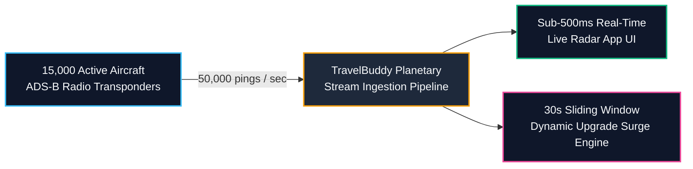

import { Callout } from 'fumadocs-ui/components/callout';
import { Tabs, Tab } from 'fumadocs-ui/components/tabs';
import { Steps, Step } from 'fumadocs-ui/components/steps';
import { Cards, Card } from 'fumadocs-ui/components/card';

## The Mission & Scale

TravelBuddy is launching its flagship consumer feature: **Live Global Flight Radar**.

Every commercial passenger can open the TravelBuddy mobile application to view real-time 3D flight paths across the globe, receive instant turbulence and delay advisories, and purchase last-minute premium seat upgrades whose prices update dynamically every 30 seconds based on localized airspace congestion and remaining cabin inventory.



### Scale & Service-Level Objectives (SLOs)
- **Ingestion Throughput**: 15,000 concurrent commercial aircraft broadcasting ADS-B telemetry pings every 300–500ms $\implies \mathbf{50,000\text{ events/sec}}$ continuously ($\sim 150,000\text{ events/sec}$ peak during storm re-routings).
- **End-to-End Latency**: Sub-500ms from transponder ping broadcast to mobile screen rendering.
- **Active Passengers**: 5,000,000 concurrent mobile app sessions viewing live radar tiles during peak holiday travel.
- **Surge Window Calculation**: 30-second sliding windows evaluating airspace sector congestion, remaining first-class/business seat inventory, and passenger willingness-to-pay elasticity.

---

## End-to-End System Architecture

To fulfill these requirements without dropping telemetry or corrupting financial state, TravelBuddy uses the **Unbundled Streaming Data Platform**:

```mermaid
flowchart TD
    subgraph EdgeIngest["1. Perimeter & Ingestion Layer"]
        ADS["ADS-B Receiver Stations & Satellites"]
        LB["Global Anycast Layer 4 Load Balancer"]
        Gateway["Telemetry Ingestion Gateway (Netty / Rust)"]
    end

    subgraph KafkaCore["2. Distributed Commit Log (Kafka)"]
        K_Tele{{"Topic: aircraft-telemetry<br/>64 Partitions (Key: flight_id)"}}
        K_Book{{"Topic: booking-cdc<br/>16 Partitions (Key: flight_id)"}}
    end

    subgraph OLTP["3. Core Operational Database"]
        PG[("PostgreSQL Cluster<br/>Flight Manifests & Cabin Inventory")]
        Deb["Debezium CDC Connector"]
        PG --> Deb --> K_Book
    end

    subgraph StreamCompute["4. Continuous Stream Processor (Apache Flink)"]
        Flink["Flink Job 1: Geospatial H3 Binning & Speed Vectors<br/>Flink Job 2: Dynamic Surge Pricing 30s Sliding Window"]
    end

    subgraph ServingLayer["5. Polyglot Serving Tier"]
        RedisCluster[("Redis Cluster<br/>Geospatial GEOHASH Cache & Pub/Sub")]
        ClickHouse[("ClickHouse OLAP Cluster<br/>Geospatial Analytics & Historical Trails")]
        WSGateway["WebSocket Gateway Cluster (50k connections/node)"]
    end

    subgraph Clients["6. Consumer Endpoints"]
        App["Passenger Mobile App (Mapbox WebGL UI)"]
    end

    ADS --> LB --> Gateway --> K_Tele
    K_Tele --> Flink
    K_Book --> Flink
    Flink -- "Low-Latency State" --> RedisCluster
    Flink -- "Micro-batch bulk append" --> ClickHouse
    RedisCluster -- "Pub/Sub Broadcast" --> WSGateway
    WSGateway --> App
    ClickHouse -. "Historical path queries" .-> Gateway

    style EdgeIngest fill:#020617,stroke:#64748b,stroke-width:1px
    style KafkaCore fill:#0f172a,stroke:#38bdf8,stroke-width:2px
    style OLTP fill:#0f172a,stroke:#3b82f6,stroke-width:2px
    style StreamCompute fill:#0f172a,stroke:#ec4899,stroke-width:2px
    style ServingLayer fill:#0f172a,stroke:#10b981,stroke-width:2px
    style Clients fill:#020617,stroke:#64748b,stroke-width:1px
```



---

## Data Contracts & Schemas

In high-throughput stream processing, untyped JSON introduces high CPU serialization overhead and risks schema corruption. TravelBuddy enforces strict **Apache Avro** schemas registered with the Confluent Schema Registry.

<Tabs items={['ADS-B Telemetry Avro Schema', 'Dynamic Surge Price Event Schema']}>
  <Tab value="ADS-B Telemetry Avro Schema">
```json
{
  "type": "record",
  "name": "AircraftTelemetryPing",
  "namespace": "com.travelbuddy.telemetry",
  "doc": "High-frequency ADS-B GPS ping from airborne transponders",
  "fields": [
    {"name": "flight_id", "type": "string", "doc": "e.g. TB-904"},
    {"name": "tail_number", "type": "string", "doc": "e.g. N78003"},
    {"name": "timestamp_epoch_ms", "type": "long", "doc": "Event-time hardware GPS clock"},
    {"name": "latitude", "type": "double"},
    {"name": "longitude", "type": "double"},
    {"name": "altitude_feet", "type": "int"},
    {"name": "ground_speed_knots", "type": "float"},
    {"name": "true_heading_degrees", "type": "float"},
    {"name": "vertical_rate_fpm", "type": "int"},
    {"name": "squawk_code", "type": "string", "doc": "Air traffic transponder squawk"}
  ]
}
```
  </Tab>

  <Tab value="Dynamic Surge Price Event Schema">
```json
{
  "type": "record",
  "name": "CabinUpgradeSurgeQuote",
  "namespace": "com.travelbuddy.pricing",
  "doc": "Calculated every 30s by Apache Flink dynamic pricing engine",
  "fields": [
    {"name": "quote_id", "type": "string"},
    {"name": "flight_id", "type": "string"},
    {"name": "h3_airspace_cell", "type": "string", "doc": "Uber H3 Hexagonal Cell Index"},
    {"name": "window_end_epoch_ms", "type": "long"},
    {"name": "remaining_first_class_seats", "type": "int"},
    {"name": "airspace_congestion_factor", "type": "float"},
    {"name": "base_upgrade_usd", "type": "double"},
    {"name": "surge_multiplier", "type": "float"},
    {"name": "final_upgrade_usd", "type": "double"},
    {"name": "expires_at_epoch_ms", "type": "long"}
  ]
}
```
  </Tab>
</Tabs>

---

## Stream Processing Mechanics in Apache Flink

TravelBuddy's streaming brain is built on **Apache Flink**, executing two concurrent data pipelines:

```mermaid
flowchart TD
    subgraph IngestStreams["Incoming Kafka Topics"]
        TeleStream["aircraft-telemetry (Event Stream: 50k/s)"]
        BookStream["booking-cdc (Changelog Stream)"]
    end

    subgraph FlinkJob["Apache Flink Processing Topology"]
        direction TB
        Watermark["Assign Timestamps & BoundedOutOfOrderness(2s)"]
        Enrich["Keyed Stream-Table Join on flight_id<br/>(Tele + Current Cabin State)"]
        H3_Index["Map: Compute H3 Hex Cell Index (Resolution 6)"]
        Window["30-Second Sliding Window (Slide: 5s)<br/>Keyed by h3_airspace_cell"]
        SurgeCalc["Surge Algorithm: Congestion * Demand / Available Seats"]
    end

    subgraph Output["Sinks"]
        SinkRedis["Redis Cluster (SETEX surge:TB-904 35s)"]
        SinkClickHouse["ClickHouse (flight_telemetry_hot)"]
    end

    TeleStream --> Watermark --> Enrich
    BookStream --> Enrich
    Enrich --> H3_Index --> Window --> SurgeCalc
    SurgeCalc --> SinkRedis
    Enrich --> SinkClickHouse

    style IngestStreams fill:#020617,stroke:#64748b,stroke-width:1px
    style FlinkJob fill:#0f172a,stroke:#ec4899,stroke-width:2px
    style Output fill:#0f172a,stroke:#10b981,stroke-width:2px
```



### The Dynamic Pricing Algorithm
The surge pricing multiplier $M$ for seat upgrades on flight $f$ in airspace sector $s$ during window $W$ is calculated as:

$$M(f, s) = 1.0 + \alpha \cdot \left(\frac{C_s}{C_{\text{baseline}}}\right) + \beta \cdot \left(\frac{D_f}{S_{\text{avail}} + 1}\right)$$

Where:
- $C_s$: Number of concurrent active flights in the local H3 hexagonal airspace cell (airspace congestion).
- $C_{\text{baseline}}$: Historical median aircraft density for that sector.
- $D_f$: Active passenger app users browsing the upgrade screen for flight $f$.
- $S_{\text{avail}}$: Remaining unoccupied first-class/business seats from the booking CDC state.
- $\alpha, \beta$: Tuning constants ($\alpha = 0.35, \beta = 0.50$).

### Flink SQL Dynamic Surge Window Definition

```sql
-- Flink Streaming Table Definition
CREATE TABLE flight_telemetry_source (
    flight_id STRING,
    latitude DOUBLE,
    longitude DOUBLE,
    altitude_feet INT,
    ground_speed_knots FLOAT,
    ping_time TIMESTAMP(3),
    WATERMARK FOR ping_time AS ping_time - INTERVAL '2' SECOND
) WITH (
    'connector' = 'kafka',
    'topic' = 'aircraft-telemetry',
    'properties.bootstrap.servers' = 'kafka:9092',
    'format' = 'avro-confluent'
);

-- Real-Time Airspace Congestion Aggregation (30s Sliding Window)
CREATE VIEW airspace_sector_metrics AS
SELECT
    H3_LATLNG_TO_CELL(latitude, longitude, 6) AS h3_cell,
    COUNT(DISTINCT flight_id) AS active_aircraft_count,
    AVG(ground_speed_knots) AS avg_sector_speed_knots,
    HOP_END(ping_time, INTERVAL '5' SECOND, INTERVAL '30' SECOND) AS window_end
FROM flight_telemetry_source
GROUP BY
    H3_LATLNG_TO_CELL(latitude, longitude, 6),
    HOP(ping_time, INTERVAL '5' SECOND, INTERVAL '30' SECOND);
```

---

## ClickHouse Columnar Storage Engine: Fast Geospatial Analytics

While Redis stores the instant, hot position of aircraft for live UI rendering, analytical queries (such as rendering the last 4 hours of flight breadcrumbs or computing historical turbulence zones) hit **ClickHouse**:

```sql
CREATE TABLE travelbuddy_telemetry.aircraft_pings_local (
    flight_id LowCardinality(String),
    tail_number LowCardinality(String),
    ping_time DateTime64(3, 'UTC'),
    latitude Float64,
    longitude Float64,
    altitude_feet Int32,
    ground_speed_knots Float32,
    heading Float32,
    h3_index UInt64
) ENGINE = MergeTree()
PARTITION BY toYYYYMM(ping_time)
PRIMARY KEY (flight_id, ping_time)
ORDER BY (flight_id, ping_time)
SETTINGS index_granularity = 8192;
```

### Why This Engine Configuration Beats Traditional Databases
1. **`MergeTree` Engine**: Ingests 100,000 rows/second in parallel background merges, writing data sequentially to columnar `.bin` and sparse `.mrk` files.
2. **`LowCardinality(String)`**: Replaces string tail numbers with automatic 1-byte dictionary integers, cutting disk memory footprint by $85\%$.
3. **Primary Key `(flight_id, ping_time)`**: Scanning a 6-hour flight path for flight `TB-904` evaluates a sparse primary key index, reading only the exact 2 MB disk granule rather than scanning billions of irrelevant rows.

---

## High Availability & Disaster Recovery Plan

In aviation logistics, downtime can ground aircraft. TravelBuddy employs an **Active-Active Multi-Region** architecture across `us-east-1` and `eu-west-1`:

```mermaid
flowchart TD
    subgraph GeoRouting["Global Edge Routing"]
        Anycast["Global Anycast IP / Cloudflare Magic Transit"]
    end

    subgraph RegionUS["Primary Region A (us-east-1)"]
        K_US["Kafka Cluster A<br/>MirrorMaker 2 Active"]
        Flink_US["Flink Cluster A"]
        Redis_US["Redis Cluster A"]
    end

    subgraph RegionEU["Primary Region B (eu-west-1)"]
        K_EU["Kafka Cluster B<br/>MirrorMaker 2 Active"]
        Flink_EU["Flink Cluster B"]
        Redis_EU["Redis Cluster B"]
    end

    Anycast -- "US Clients & Receivers" --> RegionUS
    Anycast -- "EU & APAC Clients" --> RegionEU

    K_US <-->|"MirrorMaker 2 Bi-Directional Active Replication"| K_EU

    style GeoRouting fill:#020617,stroke:#64748b,stroke-width:1px
    style RegionUS fill:#0f172a,stroke:#3b82f6,stroke-width:2px
    style RegionEU fill:#0f172a,stroke:#10b981,stroke-width:2px
```



### Disaster Recovery Runbook
1. **Kafka Broker Outage**: Partitions configured with `min.insync.replicas=2` and `replication.factor=3`. A single broker crash causes partition leadership failover in under 200ms with zero message loss (`acks=all`).
2. **Transatlantic Fiber Severance**: In the event of network partition between AWS US and EU regions, each region continues ingesting local telemetry and computing localized surge pricing autonomously. MirrorMaker 2 buffers offset deltas and reconciles once connectivity is restored.
3. **Consumer Lag Spike**: If Flink task managers encounter GC pressure, auto-scalers spin up additional task slots, dynamically repartitioning the 64 Kafka telemetry partitions across additional worker containers via Kubernetes KEDA.

---

## Architectural Review Checklist

- [x] **Ingestion Scalability**: 64 Kafka partitions handle 50,000 pings/sec with headroom for $5\times$ spikes.
- [x] **Sub-500ms Radar Latency**: Bypasses heavy database writes; Flink pipes directly to Redis Pub/Sub and WebSocket gateways.
- [x] **Dynamic Pricing Soundness**: Uses event-time sliding windows and CDC cabin state, preventing race conditions or phantom over-allocations.
- [x] **Deep Auditability**: Telemetry streams are archived in ClickHouse and S3 Parquet lakes, enabling full post-incident flight recreation.
