import { Callout } from 'fumadocs-ui/components/callout';
import { Tabs, Tab } from 'fumadocs-ui/components/tabs';
import { Steps, Step } from 'fumadocs-ui/components/steps';
import { Cards, Card } from 'fumadocs-ui/components/card';

## The Architectural Frontier: Systems of Record vs. Derived Data

In classical database engineering, systems are designed around a single, monolithic question: *“How do we store this entity reliably so that a transactional query can update and read it without corruption?”*

Parts 1 and 2 of Martin Kleppmann’s *Designing Data-Intensive Applications* answered that question through storage engines (B-Trees, LSM-Trees), replication protocols (leader-follower, multi-leader, quorum), partitioning (hash vs. range), and distributed transactions (ACID isolation levels, 2-Phase Commit).

However, in modern enterprise engineering, **no single database engine can satisfy all read, write, analytic, and search requirements simultaneously**.

```mermaid
flowchart TD
    subgraph SOR["System of Record (Source of Truth)"]
        PG[("OLTP PostgreSQL<br/>ACID Transactions<br/>Normalized State")]
    end

    subgraph DD["Derived Data Systems (Transformed Views)"]
        direction TB
        ES[("Elasticsearch<br/>Full-Text Search & Inverted Indexes")]
        RD[("Redis<br/>Sub-millisecond In-Memory Caching")]
        CH[("ClickHouse / Snowflake<br/>Columnar OLAP Aggregations")]
        GDB[("Neo4j<br/>Graph Traversal Engine")]
    end

    PG -- "CDC Stream / ETL Batch" --> DD

    style PG fill:#1e293b,stroke:#3b82f6,stroke-width:2px,color:#f8fafc
    style ES fill:#0f172a,stroke:#f59e0b,stroke-width:2px,color:#f8fafc
    style RD fill:#0f172a,stroke:#ef4444,stroke-width:2px,color:#f8fafc
    style CH fill:#0f172a,stroke:#10b981,stroke-width:2px,color:#f8fafc
    style GDB fill:#0f172a,stroke:#8b5cf6,stroke-width:2px,color:#f8fafc
    style SOR fill:#020617,stroke:#64748b,stroke-width:1px,stroke-dasharray: 4 4
    style DD fill:#020617,stroke:#64748b,stroke-width:1px,stroke-dasharray: 4 4
```

Part 3 of DDIA introduces the decisive mental model shift that separates junior backend developers from principal distributed systems architects:

<Callout type="info" title="The Fundamental Duality: Systems of Record vs. Derived Data">
- **System of Record (Source of Truth)**: The authoritative, canonical state of your business entities. When a user books a flight or charges a credit card, the transaction writes directly here first. Changes are authoritative; if a discrepancy arises, the System of Record is right by definition.
- **Derived Data**: Data created by taking existing data from another system and transforming, indexing, aggregating, or caching it. If you lose derived data, you can recreate it from scratch by re-running the deterministic transformation pipeline over the System of Record.
</Callout>

In this track, we study the two primary computational paradigms used to bridge systems of record to derived data systems: **Batch Processing** (bounded, historical computation) and **Stream Processing** (unbounded, real-time event logs), concluding with Kleppmann’s vision of **Unbundling the Database**.

---

## The TravelBuddy Production Reality

To make these principles concrete, we will track the architectural evolution of **TravelBuddy**, a global flight booking, live radar, and dynamic travel logistics platform operating at planet scale.

TravelBuddy experiences two fundamentally different computational realities:

```mermaid
flowchart LR
    subgraph Batch["Batch Analytics (Nightly)"]
        direction TB
        B1["1.2 Billion boarding pass scans & ticket events"]
        B2["Airline Route Profitability Analysis"]
        B3["Annual Frequent Flyer Tier Recalculations"]
        B4["Fuel Hedging Cost Optimization Models"]
    end

    subgraph Streaming["Real-Time Streaming (Continuous)"]
        direction TB
        S1["50,000 GPS ADS-B pings/sec from 15,000 aircraft"]
        S2["Sub-second Flight Delay & Gate Change Push Alerts"]
        S3["Dynamic Surge Pricing Engine for seat upgrades"]
        S4["Live Global Flight Radar Map updates via WebSockets"]
    end

    style Batch fill:#0f172a,stroke:#3b82f6,stroke-width:2px
    style Streaming fill:#0f172a,stroke:#10b981,stroke-width:2px
```

1. **The Bounded Batch World**: At midnight UTC, TravelBuddy crunches 1.2 billion ticketing transactions, partner airline settlement reconciliations, passenger manifests, and route operational costs. It does not need sub-second latency; it demands **deterministic correctness, massive throughput, and resilience against hardware failures mid-computation**.
2. **The Unbounded Streaming World**: 15,000 commercial airliners in flight transmit automatic dependent surveillance-broadcast (ADS-B) radio pings every 500 milliseconds. When an air traffic ground delay hits Chicago O'Hare (ORD), 45,000 connecting passengers must receive instant push notifications with rerouted gates and dynamic accommodation vouchers before their wheels touch the tarmac.

---

## Global Data Pipeline Architecture

The complete end-to-end data pipeline uniting these two worlds is shown below:

```mermaid
flowchart TD
    subgraph Ingestion["1. Ingestion Layer"]
        App["Passenger Mobile & Web Apps"]
        Aircraft["15,000 Aircraft Transponders (ADS-B)"]
        Partner["Airline GDS Systems (Sabre / Amadeus)"]
    end

    subgraph OLTP["2. Operational Core"]
        API["TravelBuddy API Gateway"]
        PG[("PostgreSQL DB<br/>Bookings & Customer State")]
    end

    subgraph StreamLog["3. Distributed Event Log"]
        Debezium["Debezium CDC Connector"]
        Kafka{{"Apache Kafka Cluster<br/>Topics: flight-telemetry, reservations, delays"}}
    end

    subgraph RealTimeStream["4. Stream Processing (Low Latency)"]
        Flink["Apache Flink<br/>Sliding Windows & Stream Joins"]
        Redis[("Redis Cluster<br/>Live Radar & Hot Cache")]
        Push["WebSocket Push Gateway"]
    end

    subgraph BatchDataLake["5. Batch Processing (High Throughput)"]
        HDFS[("HDFS / S3 Data Lake<br/>Parquet Cold Storage")]
        Spark["Apache Spark / MapReduce<br/>Nightly Profitability & Loyalty"]
        Warehouse[("ClickHouse / Snowflake<br/>OLAP Data Warehouse")]
    end

    App --> API
    Aircraft --> Kafka
    Partner --> API
    API --> PG
    PG --> Debezium
    Debezium --> Kafka
    Kafka --> Flink
    Flink --> Redis
    Redis --> Push
    Push --> App
    Kafka --> HDFS
    HDFS --> Spark
    Spark --> Warehouse
    Flink --> Warehouse

    style Ingestion fill:#020617,stroke:#64748b,stroke-width:1px
    style OLTP fill:#0f172a,stroke:#3b82f6,stroke-width:2px
    style StreamLog fill:#0f172a,stroke:#ec4899,stroke-width:2px
    style RealTimeStream fill:#0f172a,stroke:#10b981,stroke-width:2px
    style BatchDataLake fill:#0f172a,stroke:#f59e0b,stroke-width:2px
```

---

## Track Curriculum & Navigation

This track is divided into five deep engineering modules and a comprehensive reference cheat sheet:

<Cards>
  <Card
    title="01: Batch Processing & MapReduce"
    href="/docs/system-design/04-batch-streaming-and-future/01-batch-processing-and-mapreduce"
    icon="Cpu"
    description="DDIA Ch 10: Unix pipes, HDFS architecture, Map-Shuffle-Sort-Reduce mechanics, distributed joins (broadcast vs sort-merge), and the evolution to Spark and Flink."
  />
  <Card
    title="02: Stream Processing & Kafka"
    href="/docs/system-design/04-batch-streaming-and-future/02-stream-processing-and-kafka"
    icon="Activity"
    description="DDIA Ch 11: Log-based message brokers, Kafka partitions & consumer groups, Debezium CDC, Event Sourcing, windowing semantics, and exactly-once processing."
  />
  <Card
    title="03: The Future of Data Systems"
    href="/docs/system-design/04-batch-streaming-and-future/03-the-future-of-data-systems"
    icon="Compass"
    description="DDIA Ch 12: Unbundling the database, Lambda vs Kappa architecture, derived data materialized views, end-to-end correctness, and immutable audit ledgers."
  />
  <Card
    title="Capstone: Real-Time Flight Radar"
    href="/docs/system-design/04-batch-streaming-and-future/capstone-realtime-flight-radar"
    icon="Terminal"
    description="Architecting TravelBuddy's planetary ADS-B telemetry ingestion and dynamic seat upgrade surge pricing engine with Flink, Kafka, and ClickHouse."
  />
  <Card
    title="Quick Reference & Cheat Sheets"
    href="/docs/system-design/04-batch-streaming-and-future/quick-reference"
    icon="Layers"
    description="High-yield synthesis tables: Batch vs Stream matrix, Kafka tuning parameters, distributed join selector, and DDIA Part 3 design axioms."
  />
</Cards>
