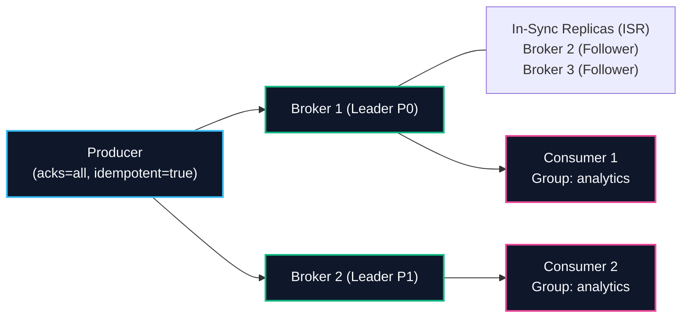

import { Callout } from 'fumadocs-ui/components/callout';
import { Tabs, Tab } from 'fumadocs-ui/components/tabs';
import { Steps, Step } from 'fumadocs-ui/components/steps';
import { Cards, Card } from 'fumadocs-ui/components/card';

## 1. Batch vs. Stream Processing Matrix

| Engineering Dimension | Batch Processing (DDIA Ch 10) | Stream Processing (DDIA Ch 11) |
| :--- | :--- | :--- |
| **Data Nature** | Bounded, finite dataset (known start & end) | Unbounded, continuous infinite event stream |
| **Latency Target** | Minutes to hours (High latency tolerated) | Milliseconds to seconds (Sub-second target) |
| **Throughput** | Maximum throughput; saturates all CPU & disk | Optimized for sustained event flow & low jitter |
| **Fault Tolerance Model** | Deterministic task restart (Pure functions, no side-effects) | Distributed snapshotting (Chandy-Lamport) + log replay |
| **Time Semantics** | File timestamps / job execution date | Event Time vs. Ingestion Time vs. Processing Time |
| **Join Mechanics** | Static full dataset joins (Sort-merge, broadcast) | Windowed stream-stream joins or stream-table joins |
| **Typical Engines** | Apache Spark, Hadoop MapReduce, AWS EMR | Apache Flink, Kafka Streams, Spark Structured Streaming |
| **Primary Use Cases** | Nightly payroll, route profitability, ML training datasets | Real-time fraud detection, live flight radar, push alerts |

---

## 2. Distributed Join Algorithm Selector

When designing distributed batch data pipelines, select your join algorithm using this decision table:

| Join Algorithm | Condition & Sizing | Shuffle Network Cost | Memory Requirement | Hot-Key Skew Risk |
| :--- | :--- | :--- | :--- | :--- |
| **Broadcast Hash Join** *(Map-Side)* | One table fits comfortably in worker memory ($< 100\text{ MB}$) | **Zero** network shuffle for large table | Medium (stores small table in worker RAM) | **Zero** |
| **Partitioned Hash Join** *(Bucket Join)* | Both tables large, but **pre-bucketed** by join key on disk | **Zero** network shuffle during job | Low (loads one bucket partition at a time) | Low |
| **Sort-Merge Join** *(Reduce-Side)* | Arbitrary large tables, neither fits in memory | **Heavy** (100% data transferred across network) | Low (streams sorted iterators) | **Extremely High** (hot keys overload single reducer) |

---

## 3. Apache Kafka Production Architecture Cheat Sheet

### Core Component Reference



### Critical Producer & Broker Configurations

```properties
# --- PRODUCER RESILIENCY (Zero Data Loss) ---
acks=all
enable.idempotence=true
max.in.flight.requests.per.connection=5
retries=2147483647
compression.type=zstd

# --- TOPIC & BROKER DURABILITY ---
replication.factor=3
min.insync.replicas=2
unclean.leader.election.enable=false

# --- PERFORMANCE & ZERO-COPY ---
# Kernel-level transfer from page cache straight to network socket
# Bypasses JVM user-space memory
sendfile=true
```

---

## 4. Lambda vs. Kappa Architecture Cheat Sheet

```mermaid
flowchart TD
    subgraph Lambda["Lambda Architecture"]
        L1["Events"] --> L2["Batch Layer (Spark/Hadoop)"]
        L1 --> L3["Speed Layer (Flink/Storm)"]
        L2 --> L4["Serving View (Merge at Read)"]
        L3 --> L4
    end

    subgraph Kappa["Kappa Architecture"]
        K1["Immutable Log (Kafka)"] --> K2["Unified Stream Engine (Flink)"]
        K2 --> K3["Serving View (Derived Store)"]
    end

    style Lambda fill:#0f172a,stroke:#ef4444,stroke-width:1px
    style Kappa fill:#0f172a,stroke:#10b981,stroke-width:2px
```



| Criteria | Lambda Architecture | Kappa Architecture |
| :--- | :--- | :--- |
| **Number of Codebases** | **Two** (one for batch, one for stream) | **One** (unified stream logic) |
| **Data Drift Risk** | High (batch and stream logic diverge over time) | None (single code path for past and present) |
| **How to Reprocess History** | Run standard batch job on lakehouse | Rewind Kafka consumer group offset to `0` and replay |
| **Complexity** | High operational overhead | Requires long log retention or tiered storage (S3/Kafka) |

---

## 5. Martin Kleppmann's DDIA Part 3: Golden Axioms

1. **The Stream-Table Dualism**:
   > *“A table is state at a point in time; a stream is the history of changes. Replaying a stream creates a table; recording changes to a table creates a stream.”*
2. **The Unbundled Database**:
   > *“Do not force one database engine to be your OLTP store, full-text search index, and analytics warehouse. Use an append-only commit log to feed specialized derived data stores.”*
3. **The End-to-End Principle Over ACID**:
   > *“A transaction inside a database cannot protect you from network drops between client and server. Build idempotent interfaces at the edge rather than relying on distributed two-phase commit.”*
4. **Immutability Over In-Place Mutation**:
   > *“Never `UPDATE` or `DELETE` accounting records. Follow the 500-year-old wisdom of accountants: record compensating transactions and retain an unbroken audit trail.”*
