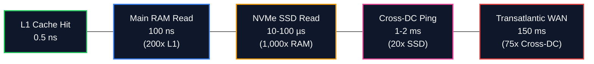

import { Callout } from 'fumadocs-ui/components/callout';
import { Tabs, Tab } from 'fumadocs-ui/components/tabs';
import { Steps, Step } from 'fumadocs-ui/components/steps';
import { Cards, Card } from 'fumadocs-ui/components/card';

## The Architectural Foundation of Quantitative Sizing

Before drafting a single service boundary or drawing a database schema, an architect must establish the **order-of-magnitude bounds** of the system.

Back-of-the-envelope calculations are not about computing 6 decimal places of precision; they are about **ruling out invalid architectural paths immediately**:
- If an algorithm requires 4 Terabytes of random RAM lookups per second, you cannot use a single PostgreSQL instance.
- If storage growth is 200 Petabytes over 5 years, you cannot store raw blobs in transactional NVMe block storage; you must plan for tiered S3 object storage with columnar Parquet compaction.
- If network egress is 40 Gbps, you need multi-homed edge CDN caching to avoid cloud egress bankruptcy.

---

## The Engineer's Mental Reference Tables

### 1. The Powers of Two & Storage Scale

In distributed systems, storage is binary. Memorize these conversion powers:

| Power ($2^n$) | Exact Value (Bytes) | Approximate Decimal Value | Name | Symbol | Real-World Context |
| :--- | :--- | :--- | :--- | :--- | :--- |
| $2^{10}$ | $1,024$ | $1\text{ Thousand } (10^3)$ | Kilobyte | **1 KB** | Typical JSON payload |
| $2^{20}$ | $1,048,576$ | $1\text{ Million } (10^6)$ | Megabyte | **1 MB** | Small MP3, high-res photo |
| $2^{30}$ | $1,073,741,824$ | $1\text{ Billion } (10^9)$ | Gigabyte | **1 GB** | Mobile RAM, large video |
| $2^{40}$ | $1,099,511,627,776$ | $1\text{ Trillion } (10^{12})$ | Terabyte | **1 TB** | Production SSD drive |
| $2^{50}$ | $1,125,899,906,842,624$ | $1\text{ Quadrillion } (10^{15})$ | Petabyte | **1 PB** | Enterprise data lake |
| $2^{60}$ | $1,152,921,504,606,846,976$ | $1\text{ Quintillion } (10^{18})$ | Exabyte | **1 EB** | Hyperscaler data center tier |

<Callout type="info" title="The Golden Time Constant">
$$\text{Seconds in a day} = 24 \times 60 \times 60 = \mathbf{86,400\text{ seconds}}$$
For fast back-of-the-envelope mental math, approximate:
$$86,400 \approx \mathbf{10^5\text{ seconds}} \quad (100,000\text{ seconds})$$
*(Note: Using $10^5$ yields a conservative estimate that is roughly $15\%$ lower than actual seconds, providing a built-in safety margin for daily averages).*
</Callout>

---

### 2. Latency Numbers Every Distributed Systems Engineer Must Know

Published initially by Google Fellow **Jeff Dean**, these physical hardware latencies dictate every caching, storage, and networking trade-off:

| Operation | Human Normalized Scale (if 0.5 ns = 1 Heartbeat) | Latency |
| :--- | :--- | :--- |
| **L1 CPU Cache Reference** | 1 beat (0.5 sec) | $0.5\text{ ns}$ |
| **Branch Mispredict** | 5 beats (2.5 sec) | $5\text{ ns}$ |
| **L2 CPU Cache Reference** | 14 beats (7 sec) | $7\text{ ns}$ |
| **Mutex Lock / Unlock** | 50 beats (25 sec) | $25\text{ ns}$ |
| **Main Memory (RAM) Access** | 3.3 minutes | $100\text{ ns}$ |
| **Compress 1KB with Snappy** | 1.6 hours | $2,000\text{ ns } (2\text{ µs})$ |
| **Read 1MB Sequentially from RAM** | 2.1 hours | $250\text{ µs}$ |
| **NVMe Flash SSD Random Read** | 1.1 days | $100\text{ µs}$ |
| **Read 1MB Sequentially from SSD** | 11.5 hours | $1,000\text{ µs } (1\text{ ms})$ |
| **Roundtrip Intra-Datacenter Network** | 5.7 days | $500\text{ µs } (0.5\text{ ms})$ |
| **Roundtrip US to Europe (Transatlantic WAN)** | 4.7 years | $150\text{ ms}$ |

---

## Universal Estimation Formulas

### 1. Queries Per Second (QPS)
$$\text{Average QPS} = \frac{\text{Daily Active Operations}}{86,400}$$

$$\text{Peak QPS} = k \times \text{Average QPS} \quad \text{where } k \in [2, 5]$$

- For typical consumer web applications (e-commerce, search), peak multiplier $k \approx 2$ to $3$.
- For event-driven traffic (ticketing drops, breaking news, market opening), $k \approx 4$ to $10$.

### 2. Multi-Year Storage Growth
$$\text{Daily Raw Ingress} = \text{Daily Writes} \times \text{Average Record Payload Size}$$

$$\text{Total 5-Year Storage} = \text{Daily Raw Ingress} \times 365 \times 5 \times R \times (1 + I)$$

Where:
- $R$: Replication factor (typically $R = 3$ in distributed systems like HDFS, Ceph, or Cassandra).
- $I$: Indexing and metadata overhead (typically $I \approx 0.20$, or $20\%$).

### 3. Network Bandwidth
$$\text{Egress Throughput (Bytes/s)} = \text{Peak Read QPS} \times \text{Average Response Payload Size}$$

$$\text{Egress Bandwidth (Gbps)} = \frac{\text{Egress Throughput (Bytes/s)} \times 8}{10^9}$$

*(Multiply by 8 to convert bytes to bits, divide by $10^9$ for Gigabits per second).*

### 4. Memory Caching Requirement (The 80/20 Pareto Rule)
Vilfredo Pareto's principle holds strongly across web applications: **80% of read traffic targets 20% of active content.**
$$\text{Daily Hot Data Working Set} = \text{Daily Read Ingress} \times 0.20$$
$$\text{Cache RAM Required} = \text{Daily Hot Data Working Set} \times \text{Buffer Margin } (1.25)$$

---

## Worked Production Case Study: TravelBuddy at 50M DAU

Let's size the entire planetary infrastructure for **TravelBuddy** based on real production metrics:

### 1. System Input Assumptions
- **Daily Active Users (DAU)**: $\mathbf{50,000,000}$ ($50\text{M}$).
- **Flight Searches per User/Day**: $5$ queries/day $\implies \mathbf{250,000,000\text{ searches/day}}$.
- **Flight Bookings per User/Day**: $0.1$ bookings/day (conversion rate $2\%$) $\implies \mathbf{5,000,000\text{ bookings/day}}$.
- **Average Flight Search Response Size**: $20\text{ KB}$ (list of 50 flight route options with seat pricing).
- **Average Booking Record Size**: $2\text{ KB}$ (passenger manifest, payment tokens, PNR).
- **Traffic Multiplier**: Peak-to-average ratio $k = 3$.

---

### 2. QPS Calculations (Reads vs. Writes)

#### Read Path (Flight Searches):
$$\text{Average Read QPS} = \frac{250,000,000\text{ searches}}{86,400\text{ s}} \approx \mathbf{2,893\text{ queries/sec}}$$

$$\text{Peak Read QPS} = 2,893 \times 3 \approx \mathbf{8,680\text{ queries/sec}} \quad (\approx \mathbf{8.7\text{k QPS}})$$

#### Write Path (Confirmed Bookings):
$$\text{Average Write QPS} = \frac{5,000,000\text{ bookings}}{86,400\text{ s}} \approx \mathbf{57.8\text{ bookings/sec}}$$

$$\text{Peak Write QPS} = 57.8 \times 3 \approx \mathbf{174\text{ bookings/sec}}$$

<Callout type="info" title="Read/Write Asymmetry Insight">
$$\text{Read-to-Write Ratio} = \frac{250\text{M searches}}{5\text{M bookings}} = \mathbf{50 : 1}$$
TravelBuddy is an intensely **read-heavy** system. Caching and read replicas will yield massive ROI.
</Callout>

---

### 3. Storage Calculations (5-Year Horizon)

#### Daily Ingress (Bookings):
$$\text{Daily Raw Write Volume} = 5,000,000 \times 2\text{ KB} = 10,000,000\text{ KB} = \mathbf{10\text{ GB/day}}$$

#### 5-Year Storage Footprint:
$$\text{Raw 5-Year Data} = 10\text{ GB/day} \times 365\text{ days} \times 5\text{ years} = \mathbf{18,250\text{ GB}} \approx \mathbf{18.25\text{ TB}}$$

Factoring in a distributed replication factor of $R = 3$ and $20\%$ B-tree secondary index overhead ($I = 0.20$):
$$\text{Total Production Disk Capacity} = 18.25\text{ TB} \times 3 \times 1.20 = \mathbf{65.7\text{ TB}}$$

*Conclusion*: At $65.7\text{ TB}$ over 5 years, TravelBuddy's transactional relational database does not even strictly require extreme sharding immediately—a partitioned primary with 3 read replicas on NVMe drives can comfortably store transactional state.

---

### 4. Bandwidth Calculations

#### Peak Network Egress (Search Traffic to Passengers):
$$\text{Peak Egress Throughput} = 8,680\text{ QPS} \times 20\text{ KB/query} = 173,600\text{ KB/s} \approx \mathbf{173.6\text{ MB/s}}$$

Converting to Network Bits per second:
$$\text{Peak Egress Bandwidth} = \frac{173.6\text{ MB/s} \times 8}{1,000} \approx \mathbf{1.39\text{ Gbps}}$$

*Conclusion*: A $1.39\text{ Gbps}$ egress stream is easily handled by modern cloud VPC network interfaces, but edge CDN caching for static flight schedules will reduce origin egress by $> 60\%$.

---

### 5. Memory / Redis Cache Sizing (80/20 Pareto Rule)

Total daily flight search result volume:
$$\text{Total Daily Search Data} = 250,000,000 \times 20\text{ KB} = 5,000,000,000\text{ KB} = \mathbf{5\text{ TB/day}}$$

Applying the 80/20 Pareto rule (cache the top 20% most popular routes: JFK $\to$ LAX, LHR $\to$ CDG):
$$\text{Hot Working Set} = 5\text{ TB} \times 0.20 = \mathbf{1\text{ TB of RAM}}$$

Adding a $25\%$ safety buffer for Redis key metadata, expiration dicts, and memory fragmentation:
$$\text{Total Redis Cluster RAM Sizing} = 1\text{ TB} \times 1.25 = \mathbf{1.25\text{ TB}}$$

```mermaid
flowchart TD
    Total["250M Daily Searches (5 TB Total Data)"]
    Pareto["20% Hot Routes (80% Traffic) = 1.0 TB"]
    Buffer["25% Redis Overhead Buffer = 0.25 TB"]
    Nodes["Cluster Sizing: 20x AWS r6g.xlarge Nodes (64GB RAM each) = 1.28 TB Total"]

    Total --> Pareto --> Buffer --> Nodes

    style Total fill:#0f172a,stroke:#64748b,stroke-width:1px
    style Pareto fill:#0f172a,stroke:#3b82f6,stroke-width:2px
    style Buffer fill:#0f172a,stroke:#f59e0b,stroke-width:2px
    style Nodes fill:#14532d,stroke:#22c55e,stroke-width:2px,color:#f8fafc
```

**Cluster Hardware Specification**:
Using standard AWS Redis instances (`cache.r6g.xlarge` with 26.3 GB RAM):
$$\text{Instances Required} = \frac{1,250\text{ GB}}{26.3\text{ GB/instance}} \approx \mathbf{48\text{ nodes}} \quad (24\text{ primaries} + 24\text{ replicas})$$

---

## Capacity Estimation Fast Cheat Sheet

When in an interview or architecture design review, follow this 4-step sequence:

