import { Callout } from 'fumadocs-ui/components/callout';
import { Tabs, Tab } from 'fumadocs-ui/components/tabs';
import { Steps, Step } from 'fumadocs-ui/components/steps';
import { Cards, Card } from 'fumadocs-ui/components/card';

## Why Rate Limiting is Non-Negotiable

In distributed systems, an unprotected API is an invitation to bankruptcy or downtime. 

When TravelBuddy opened its public flight search API, it immediately encountered three production crises:
1. **Ticket Scalper Bots**: Automated scraper bots queried the seat booking endpoint 4,000 times a second, locking up business-class seats before human travelers could load the checkout screen.
2. **Cascading Service Death**: A misconfigured third-party corporate partner entered an infinite retry loop, sending 100,000 queries/sec into the upstream airline reservation gateway, exhausting thread pools and crashing the internal inventory service.
3. **Third-Party API Cost Explosions**: TravelBuddy pays Amadeus and Sabre $\$0.015$ per flight availability query. Without strict per-user rate limiting, a single rogue scraper cost the company $\$15,000$ in 30 minutes.

A **Rate Limiter** is a defensive control mechanism that throttles or rejects requests exceeding a predefined threshold, returning `HTTP 429 Too Many Requests`.

<Callout type="info" title="🔗 Companion Deep Dives: Security, Auth & API Contracts">
Rate limiting is one critical element of an enterprise perimeter. Explore our full production suites for companion components:
- **[REST & API Contract Modeling](/docs/full-stack-development/api-design/01-rest-and-resource-modeling)**: Learn schema contracts, status code design, and the limit+1 cursor pattern.
- **[Authentication Architecture & Machine Tokens](/docs/full-stack-development/authentication/02-api-auth-and-machine-identity)**: Machine-to-machine authentication, API key hashing, and scoped quotas.
- **[Production Web Security & DoS Defenses](/docs/full-stack-development/web-security/03-rate-limiting-and-dos-defense)**: Application-layer DDoS mitigation, volumetric filtering, and trust boundary enforcement.
</Callout>

---

## The 5 Rate Limiting Algorithms Compared

Choosing the wrong rate limiting algorithm in production can cause either severe memory exhaustion or unfair request starvation.

```mermaid
flowchart TD
    subgraph AlgTypes["5 Core Rate Limiting Algorithms"]
        direction TB
        TB["1. Token Bucket<br/>(Refills continuously; allows bursts)"]
        LB["2. Leaky Bucket<br/>(Drips at constant rate; smooths bursts)"]
        FW["3. Fixed Window Counter<br/>(Resets at edge; 2x burst vulnerability)"]
        SWL["4. Sliding Window Log<br/>(100% accurate; unbounded RAM cost)"]
        SWC["5. Sliding Window Counter<br/>(Hybrid memory-efficient approximation)"]
    end

    style AlgTypes fill:#020617,stroke:#64748b,stroke-width:1px
    style TB fill:#0f172a,stroke:#3b82f6,stroke-width:2px
    style LB fill:#0f172a,stroke:#10b981,stroke-width:2px
    style FW fill:#0f172a,stroke:#ef4444,stroke-width:2px
    style SWL fill:#0f172a,stroke:#f59e0b,stroke-width:2px
    style SWC fill:#0f172a,stroke:#8b5cf6,stroke-width:2px
```



### 1. Token Bucket
- **Mechanism**: A bucket has a maximum capacity $C$. A background process adds tokens at a steady fill rate $r$ tokens/second. Each incoming request consumes 1 token. If the bucket is empty, the request is dropped.
- **Key Advantage**: **Allows bursts of traffic**. If the system is idle, the bucket fills to $C$. A sudden spike of $C$ requests can be served instantly without delay.
- **Used By**: Amazon API Gateway, Stripe API, Spring Cloud Gateway.

### 2. Leaky Bucket
- **Mechanism**: Incoming requests enter a FIFO queue (the bucket) of capacity $C$. Requests leak out of the bottom of the bucket at a strictly constant rate $r$ to be processed by downstream workers. If the queue is full, incoming requests overflow and drop.
- **Key Advantage**: **Enforces a strictly smooth output rate**. Even if 1,000 requests arrive in 1 millisecond, downstream services receive requests at an unwavering pace of 10 requests/second.
- **Used By**: Nginx (`limit_req` module), packet-switched network routers.

### 3. Fixed Window Counter
- **Mechanism**: Time is sliced into fixed calendar windows (e.g., 1 minute: `12:00-12:01`, `12:01-12:02`). A counter tracks requests. If `counter > limit`, reject until the next window boundary resets the counter to 0.
- **Fatal Flaw (Boundary Spike)**: A user sends 100 requests at `12:00:59` and 100 requests at `12:01:01`. The window allows both, but within a 2-second span, the backend suffered **200 requests ($2\times$ the limit)**!

```mermaid
flowchart LR
    subgraph W1["Window 1 (12:00 - 12:01)"]
        R1["59s: 100 requests"]
    end
    subgraph W2["Window 2 (12:01 - 12:02)"]
        R2["01s: 100 requests"]
    end
    W1 --- W2
    Note["DANGER: 200 requests pass in a 2-second window!"]

    style W1 fill:#0f172a,stroke:#ef4444,stroke-width:1px
    style W2 fill:#0f172a,stroke:#ef4444,stroke-width:1px
```



### 4. Sliding Window Log
- **Mechanism**: Maintains a sorted set of epoch millisecond timestamps for every single request made by the user. When a new request arrives, prune all timestamps older than `now - window_size`. Count the remaining timestamps. If `count < limit`, append current timestamp and allow.
- **Key Advantage**: **Mathematically perfect accuracy**.
- **Fatal Flaw (Memory DoS)**: If an attacker sends 1,000,000 requests in a burst, you store 1,000,000 integer timestamps in Redis RAM for that single IP!

### 5. Sliding Window Counter (Cloudflare Hybrid)
- **Mechanism**: Memory-efficient hybrid between Fixed Window and Sliding Log. Tracks counters for only the **current window** and the **previous window**.
- Approximates the request count as a weighted sum based on overlap percentage:

$$\text{Estimated Requests} = \text{Count}_{\text{current}} + \text{Count}_{\text{previous}} \times \left(1 - \frac{\text{time elapsed in current window}}{\text{window duration}}\right)$$

- **Memory**: Only 2 integer scalars stored per user!
- **Accuracy**: Within $0.05\%$ of mathematically true sliding window logs.

---

### Algorithm Decision Matrix

| Algorithm | Memory Cost | CPU Cost | Handles Bursts? | Window Edge Accuracy | Production Verdict |
| :--- | :--- | :--- | :--- | :--- | :--- |
| **Token Bucket** | Minimal ($2$ floats) | Low | **Yes** (up to capacity) | High | **Best for standard REST APIs** |
| **Leaky Bucket** | High (buffers queue) | Low | **No** (flattens bursts) | High | **Best for protecting legacy batch backends** |
| **Fixed Window** | Minimal ($1$ integer) | Extremely Low | **No** ($2\times$ burst spike) | Poor ($50\%$ error at boundary) | Avoid for high-value APIs |
| **Sliding Log** | **High** ($O(N)$ timestamps) | High (ZREMRANGE) | **Yes** | **Perfect ($100\%$)** | Too expensive for public scale |
| **Sliding Counter** | Minimal ($2$ integers) | Low (math formula) | Smooth | High ($> 99.9\%$) | **Best for high-volume DDoS mitigation** |

---

## Distributed Rate Limiting with Redis & Lua Scripts

In a microservice deployment with 50 API gateway instances, local in-memory rate limiting fails because a user's requests are round-robined across all 50 nodes. 

We must store state in a centralized cluster like **Redis**.

### The Concurrency Pitfall: Race Conditions
A naive distributed implementation uses `GET` and `INCR`:
```python
# BUGGY NAIVE CODE (DO NOT USE IN PRODUCTION)
current_count = redis.get(user_id)
if current_count and int(current_count) > 100:
    return 429
redis.incr(user_id)
```
If two requests arrive at two gateway pods simultaneously when `current_count = 100`:
1. Pod 1 reads `100` $\implies$ Allowed.
2. Pod 2 reads `100` $\implies$ Allowed.
Both increment, allowing 102 requests!

### The Solution: Atomic Redis Lua Scripts
Redis executes Lua scripts **atomically in a single single-threaded execution context**. No other command can interleave.

Here is TravelBuddy's production-grade atomic **Sliding Window Counter** Lua script:

```lua
-- KEYS[1]: User rate limit key (e.g., ratelimit:user_1092)
-- ARGV[1]: Current epoch timestamp in milliseconds
-- ARGV[2]: Window size in milliseconds (e.g., 60000 for 1 minute)
-- ARGV[3]: Maximum permitted requests (e.g., 100)

local key = KEYS[1]
local now = tonumber(ARGV[1])
local window = tonumber(ARGV[2])
local limit = tonumber(ARGV[3])

local clear_before = now - window

-- 1. Remove all request timestamps older than the sliding window
redis.call('ZREMRANGEBYSCORE', key, '-inf', clear_before)

-- 2. Count the number of requests in the active window
local current_requests = redis.call('ZCARD', key)

-- 3. Check if user is over limit
if current_requests < limit then
    -- Add the current request timestamp as both member and score
    redis.call('ZADD', key, now, now)
    -- Set TTL on the sorted set so idle keys are evicted automatically
    redis.call('PEXPIRE', key, window)
    -- Return allowed (1) and remaining quota
    return {1, limit - current_requests - 1}
else
    -- Return blocked (0) and retry-after delta in milliseconds
    local oldest = redis.call('ZRANGE', key, 0, 0, 'WITHSCORES')
    local retry_after_ms = (tonumber(oldest[2]) + window) - now
    return {0, retry_after_ms}
end
```

### Python Gateway Wrapper

```python
import time
import redis

class RedisSlidingWindowRateLimiter:
    def __init__(self, redis_host='localhost', redis_port=6379):
        self.r = redis.Redis(host=redis_host, port=redis_port, decode_responses=True)
        # Load and pre-compile the Lua script for SHA1 execution
        with open("sliding_window.lua", "r") as f:
            self.lua_sha = self.r.script_load(f.read())

    def check_rate_limit(self, user_id: str, limit: int = 100, window_seconds: int = 60):
        key = f"ratelimit:{user_id}"
        now_ms = int(time.time() * 1000)
        window_ms = window_seconds * 1000

        # Execute Lua script atomically on Redis server
        result = self.r.evalsha(self.lua_sha, 1, key, now_ms, window_ms, limit)
        allowed, meta = result[0], result[1]

        if allowed == 1:
            return {"allowed": True, "remaining": meta}
        else:
            return {"allowed": False, "retry_after_seconds": max(1, meta // 1000)}
```

---

## API Gateway Architectural Blueprint

The Rate Limiter does not live in isolation; it operates as an integral middleware filter inside the **API Gateway**:

```mermaid
flowchart TD
    Client["Client / Mobile / Web"] --> TLS["1. TLS Termination & Geo-Routing"]
    TLS --> WAF["2. Web Application Firewall (DDoS, SQLi, XSS)"]
    WAF --> Auth["3. Authentication & JWT Signature Validation"]
    Auth --> RL["4. Distributed Rate Limiter (Redis Lua)"]
    RL -- "Allowed" --> Dedup["5. Idempotency & Deduplication Engine"]
    RL -- "Exceeded" --> HTTP429["Return HTTP 429 Too Many Requests"]
    Dedup --> Route["6. Reverse Proxy & Service Discovery (gRPC/HTTP)"]
    Route --> Svc1["Booking Service"]
    Route --> Svc2["Search Service"]
    Route --> Svc3["Radar Service"]

    style Client fill:#0f172a,stroke:#64748b,stroke-width:1px
    style RL fill:#0f172a,stroke:#ef4444,stroke-width:2px,color:#f8fafc
    style HTTP429 fill:#7f1d1d,stroke:#ef4444,stroke-width:1px,color:#f8fafc
    style Route fill:#0f172a,stroke:#3b82f6,stroke-width:2px
    style Svc1 fill:#0f172a,stroke:#10b981,stroke-width:1px
    style Svc2 fill:#0f172a,stroke:#10b981,stroke-width:1px
    style Svc3 fill:#0f172a,stroke:#10b981,stroke-width:1px
```



### Core Responsibilities of an Enterprise API Gateway

<Steps>
  <Step>
    #### Protocol Translation & SSL Termination
    Terminates public HTTPS / HTTP/2 / HTTP/3 connections at the edge. Translates incoming public JSON/REST payloads into high-speed internal **gRPC** calls over HTTP/2 with protobuf serialization.
  </Step>

  <Step>
    #### Centralized Authentication & Token Introspection
    Validates cryptographic signatures of incoming JSON Web Tokens (JWTs) using asymmetric RS256 public keys. Verifies scopes (`read:flights`, `write:bookings`) before forwarding requests to backend microservices, preventing downstream services from each implementing duplicate auth logic.
  </Step>

  <Step>
    #### Distributed Rate Limiting & Tiered Quotas
    Applies differentiated rate limits based on user tier:
    - **Anonymous IP**: 20 requests / minute.
    - **Authenticated Standard User**: 120 requests / minute.
    - **Enterprise Travel Agency Partner**: 5,000 requests / minute.
  </Step>

  <Step>
    #### Distributed Tracing & Observability
    Injects W3C TraceContext headers (`traceparent`, `tracestate`) and TravelBuddy correlation IDs (`X-Correlation-ID: req_849fa20`). Propagates context across all downstream microservices to enable Jaeger/OpenTelemetry distributed span profiling.
  </Step>
</Steps>

---

## Architectural Rules of Thumb

1. **Always Return Standard Headers**: When returning `HTTP 429`, include:
   - `X-RateLimit-Limit`: Maximum requests permitted in window.
   - `X-RateLimit-Remaining`: Remaining quota in current window.
   - `Retry-After`: Exact seconds the client must sleep before retrying.
2. **Never Rate Limit on Raw Client IP Alone**: Mobile devices sharing cellular carrier NAT gateways (e.g., thousands of Verizon or Vodafone users at JFK airport) share identical public IPs. Combine `IP + User-Agent + User-ID` for fair throttling.
3. **Fail-Open vs. Fail-Closed**:
   - For public content browsing $\implies$ **Fail Open** (if Redis cluster goes down, allow requests through to prevent outage).
   - For payment charging & seat locking $\implies$ **Fail Closed** (prevent systemic financial abuse).
