import { Callout } from 'fumadocs-ui/components/callout';
import { Tabs, Tab } from 'fumadocs-ui/components/tabs';
import { Steps, Step } from 'fumadocs-ui/components/steps';
import { Cards, Card } from 'fumadocs-ui/components/card';

## The Illusion of Caching Safety

A common adage in backend engineering is: *“If the database is slow, just put Redis in front of it.”*

While caching is the single most effective tool for reducing latency from milliseconds to microseconds, **an improperly designed caching layer creates the most catastrophic failure modes in distributed systems**. 

When a cache fails, it does not fail quietly—it shifts 100% of planet-scale traffic directly onto the fragile transactional database behind it, causing instant cascading collapse.

---

## The 4 Fundamental Caching Patterns

```mermaid
flowchart TD
    subgraph CA["1. Cache-Aside (Lazy Loading)"]
        CA_App["App"] -- "1. Read Cache" --> CA_Cache[("Cache")]
        CA_App -- "2. Miss: Read DB" --> CA_DB[("Database")]
        CA_App -- "3. Write Back" --> CA_Cache
    end

    subgraph RT["2. Read-Through"]
        RT_App["App"] -- "1. Read" --> RT_Cache[("Cache Layer")]
        RT_Cache -- "2. Cache fetches from DB" --> RT_DB[("Database")]
    end

    subgraph WT["3. Write-Through"]
        WT_App["App"] -- "1. Write" --> WT_Cache[("Cache Layer")]
        WT_Cache -- "2. Sync Write" --> WT_DB[("Database")]
    end

    subgraph WB["4. Write-Back (Write-Behind)"]
        WB_App["App"] -- "1. Fast Write" --> WB_Cache[("Cache Layer")]
        WB_Cache -. "2. Async Batch Drain" .-> WB_DB[("Database")]
    end

    style CA fill:#020617,stroke:#3b82f6,stroke-width:1px
    style RT fill:#020617,stroke:#10b981,stroke-width:1px
    style WT fill:#020617,stroke:#f59e0b,stroke-width:1px
    style WB fill:#020617,stroke:#ec4899,stroke-width:1px
```



### Trade-Off Comparison

| Pattern | Read Latency | Write Latency | Consistency | Risk | Best Used For |
| :--- | :--- | :--- | :--- | :--- | :--- |
| **Cache-Aside** | Fast on hit ($0.5\text{ms}$); slow on miss | Fast (writes to DB only) | Eventual (stale data possible) | Cache misses cause DB latency spikes | General web endpoints (Flight search) |
| **Read-Through** | Fast | N/A | Clean separation | Cache library must know DB protocol | Generic framework caching (Spring, Hibernate) |
| **Write-Through** | Fast | High (writes to Cache AND DB before returning) | Strong | Double-write latency penalty | Financial balances, seat locks |
| **Write-Back** | Extremely Fast | Extremely Fast | Eventual | **Data Loss**: if cache crashes before async DB flush | High-volume counters, IoT pings, telemetry |

---

## The 4 Cache Failure Modes (Disasters in Production)

```mermaid
flowchart TD
    subgraph Stampede["1. Cache Stampede (Thundering Herd)"]
        ST1["Hot Key Expires at 12:00:00<br/>(e.g., SFO->LHR Seat Map)"]
        ST2["10,000 Concurrent Readers miss simultaneously"]
        ST3["10,000 Expensive SQL queries hit PostgreSQL simultaneously!<br/>Connection pool exhausted; DB crashes!"]
        ST1 --> ST2 --> ST3
    end

    subgraph Penetration["2. Cache Penetration"]
        PE1["Attacker requests non-existent flight: flight_id=-9999"]
        PE2["Key absent from Redis; request hits PostgreSQL"]
        PE3["PostgreSQL returns NULL; nothing is cached.<br/>Attacker repeats 50,000x/sec; DB crashes!"]
        PE1 --> PE2 --> PE3
    end

    subgraph Avalanche["3. Cache Avalanche"]
        AV1["Nightly cron set TTL=3600 on 500,000 keys at 01:00:00"]
        AV2["At 02:00:00, all 500,000 keys expire at the EXACT same millisecond"]
        AV3["Total cache eviction wall; entire database collapses"]
        AV1 --> AV2 --> AV3
    end

    style Stampede fill:#7f1d1d,stroke:#ef4444,stroke-width:1px,color:#f8fafc
    style Penetration fill:#7f1d1d,stroke:#ef4444,stroke-width:1px,color:#f8fafc
    style Avalanche fill:#7f1d1d,stroke:#ef4444,stroke-width:1px,color:#f8fafc
```



---

## Cache Stampede Mitigation: Locks vs. The XFetch Algorithm

A **Cache Stampede** (also known as *Dogpiling* or the *Thundering Herd*) happens when an expensive, heavily requested cached item expires, causing hundreds or thousands of worker threads to recalculate the same item in the database concurrently.

### Solution 1: Distributed Mutex Locking (Redis `SETNX`)
When a cache miss occurs, the worker attempts to acquire an exclusive lock:
- If lock acquired $\implies$ Query database, update cache, release lock.
- If lock failed $\implies$ Sleep $50\text{ ms}$ and retry cache read.

**Limitation**: Adds polling latency to blocked threads and introduces deadlock risk if the worker process crashes while holding the lock.

---

### Solution 2: Probabilistic Early Expiration (The XFetch Algorithm)

Published in 2015 by **Vattani, Chierichetti, and Lowenstein** (*Optimal Probabilistic Cache Stampede Prevention*), the **XFetch algorithm** eliminates stampedes with zero locks and zero worker starvation.

#### The Intuition:
Instead of waiting for a key to strictly expire, workers probabilistically recompute the key **slightly before it expires**. The closer the key is to its expiration time, and the longer the database computation takes, the higher the probability that a single worker will voluntarily refresh the cache in the background!


#### The Mathematical Formula:
A worker performing a cache read evaluates the boolean test:

$$\text{Should Refresh?} \iff -\beta \times \delta \times \ln(\text{rand}()) > (\text{expiry} - \text{now})$$

Where:
- $\delta$ ($\text{delta}$): The computation time (in seconds) required to generate the value from the database.
- $\beta$ ($\text{beta}$): A tuning constant $> 0$ (default $\beta = 1.0$). Higher $\beta$ makes workers refresh more aggressively before expiration.
- $\text{rand}()$: A uniform random float sampled in $(0, 1]$.
- $\ln()$: Natural logarithm (yields a negative number, so $-\ln(\text{rand}())$ is positive).
- $\text{expiry} - \text{now}$: Remaining time-to-live in seconds.

Because $\text{rand}()$ generates a continuous exponential distribution, **exactly one worker will probabilistically trigger the refresh slightly early**, repopulating the cache before it ever expires. The thundering herd is mathematically impossible!

---

### Production Implementation of XFetch in Python

```python
import math
import random
import time
import json
import redis
from typing import Callable, Any

class XFetchCache:
    def __init__(self, redis_client: redis.Redis, beta: float = 1.0):
        self.r = redis_client
        self.beta = beta

    def get_or_compute(self, key: str, ttl_seconds: int, compute_func: Callable[[], Any]) -> Any:
        now = time.time()
        raw = self.r.get(key)

        if raw is not None:
            entry = json.loads(raw)
            val = entry["val"]
            delta = entry["delta"]
            expiry = entry["expiry"]

            # XFetch Probabilistic Early Expiration Evaluation
            # -beta * delta * ln(rand()) > (expiry - now)
            random_sample = random.random()
            # Guard against log(0)
            if random_sample == 0:
                random_sample = 0.00001

            early_refresh_threshold = -self.beta * delta * math.log(random_sample)
            time_remaining = expiry - now

            if early_refresh_threshold <= time_remaining:
                # Key is healthy; return cached value immediately
                return val

            # Probabilistic threshold exceeded! This worker voluntarily refreshes early.

        # Compute new value and benchmark computation duration delta
        t_start = time.time()
        new_val = compute_func()
        delta = max(0.001, time.time() - t_start)

        # Store value along with metadata for future XFetch evaluations
        new_expiry = now + ttl_seconds
        payload = {
            "val": new_val,
            "delta": delta,
            "expiry": new_expiry
        }

        # Set in Redis with standard TTL
        self.r.setex(key, ttl_seconds, json.dumps(payload))
        return new_val
```

---

## Cache Penetration Prevention: Bloom Filters

When malicious clients flood your API requesting thousands of IDs that do not exist in the database (e.g., `flight_id = 99999999`), every request misses the cache and pounds the relational database.

### Defense 1: Cache Null Values
When the database returns `NULL`, write a sentinel object to Redis:
```python
redis.setex(f"flight:{flight_id}", 60, json.dumps({"exists": False}))
```
Set a short TTL (e.g., 60 seconds) so future requests hit the cache and fail fast.

### Defense 2: Bloom Filter at the Perimeter
A **Bloom Filter** is a space-efficient, probabilistic data structure that tests whether an element is a member of a set:
- It can answer: **“Definitely NOT in set”** (100% certainty, zero false negatives).
- Or: **“MIGHT be in set”** (small, controlled false-positive probability $p$).

```mermaid
flowchart TD
    Req["Request: flight_id = 894012"] --> BF{"Bloom Filter Check"}
    BF -- "Definite NO (Bits 0)" --> Drop["Return HTTP 404 Immediately!<br/>Database never touched!"]
    BF -- "Probably YES" --> Cache{"Check Redis Cache"}
    Cache -- "Hit" --> Return["Return Cached Data"]
    Cache -- "Miss" --> DB[("Query PostgreSQL DB")]

    style Req fill:#0f172a,stroke:#64748b,stroke-width:1px
    style BF fill:#1e293b,stroke:#f59e0b,stroke-width:2px,color:#f8fafc
    style Drop fill:#7f1d1d,stroke:#ef4444,stroke-width:1px,color:#f8fafc
    style Cache fill:#0f172a,stroke:#3b82f6,stroke-width:1px
    style DB fill:#0f172a,stroke:#10b981,stroke-width:1px
```



#### Bloom Filter Mathematics
For a set of $n$ elements and a target false positive probability $p$:
1. Optimal bit array size $m$:
   $$m = -\frac{n \times \ln(p)}{(\ln(2))^2}$$
2. Optimal number of hash functions $k$:
   $$k = \frac{m}{n} \times \ln(2)$$

*Example*: For TravelBuddy's 10,000,000 historical flight IDs with a target false-positive rate of $1\%$ ($p = 0.01$):
- $m = 95,850,583\text{ bits} \approx \mathbf{11.4\text{ MB of RAM}}$!
- $k = 7\text{ hash functions}$.

Storing 11.4 MB in Redis RAM protects the entire relational database from millions of malicious penetration attempts!

---

## Cache Avalanche Mitigation: Jittered TTLs

When multiple keys are loaded into the cache simultaneously with the same TTL (e.g., a batch job caching 100,000 flight schedules with `TTL = 3600`), they will all expire simultaneously at second 3600.

### The Solution: Uniform TTL Jitter
Never set an exact TTL. Always add a random percentage jitter:

$$\text{Effective TTL} = \text{Base TTL} \pm \text{Random Uniform Jitter } (10\% - 20\%)$$

```python
def set_with_jitter(redis_client, key, value, base_ttl=3600, jitter_pct=0.15):
    # Jitter range: 3600 +/- 15% -> 3060 to 4140 seconds
    delta = int(base_ttl * jitter_pct)
    jittered_ttl = base_ttl + random.randint(-delta, delta)
    redis_client.setex(key, jittered_ttl, value)
```

By scattering key expirations across a 1,000-second bell curve, the database experiences a gentle, flat replenishment stream rather than a destructive cliff-edge drop.

---

## Architectural Rules of Thumb

1. **Stampedes will happen to your most popular keys**: Never rely on raw TTL expiration for high-traffic homepage or search endpoints. Use **XFetch** or distributed mutexes.
2. **Defend against non-existent keys**: Combine perimeter **Bloom Filters** with short-lived **Null object caching** to block penetration attacks.
3. **Always Jitter your Expirations**: Uniformly distribute TTL expirations by $\pm 10–20\%$ to prevent avalanche cliffs.
4. **Monitor Cache Hit Ratios**: Alert on-call engineers if your cache hit ratio drops below $95\%$; a $5\%$ drop can double or triple direct database load.
