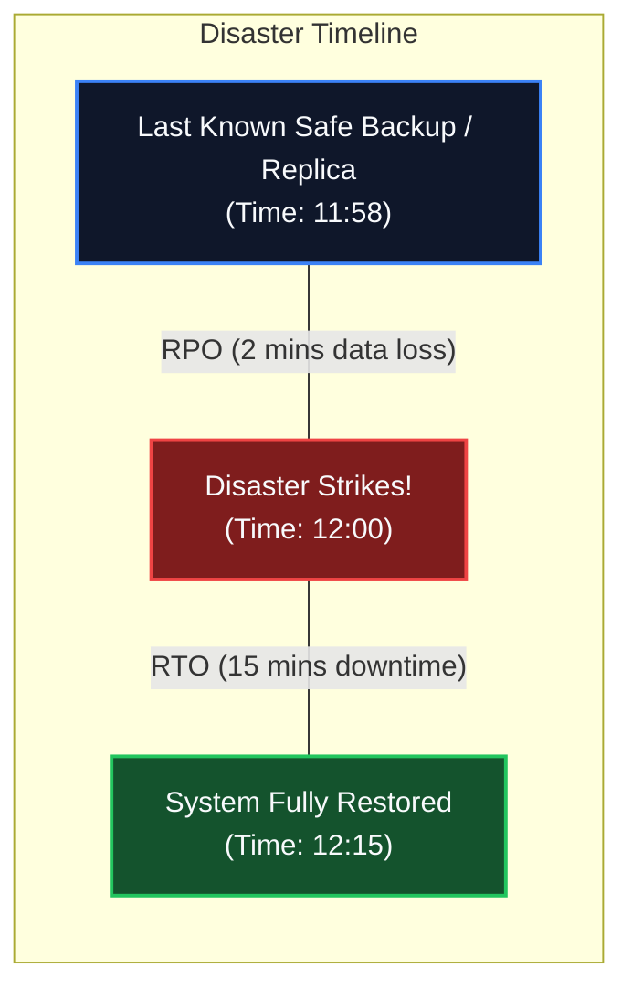
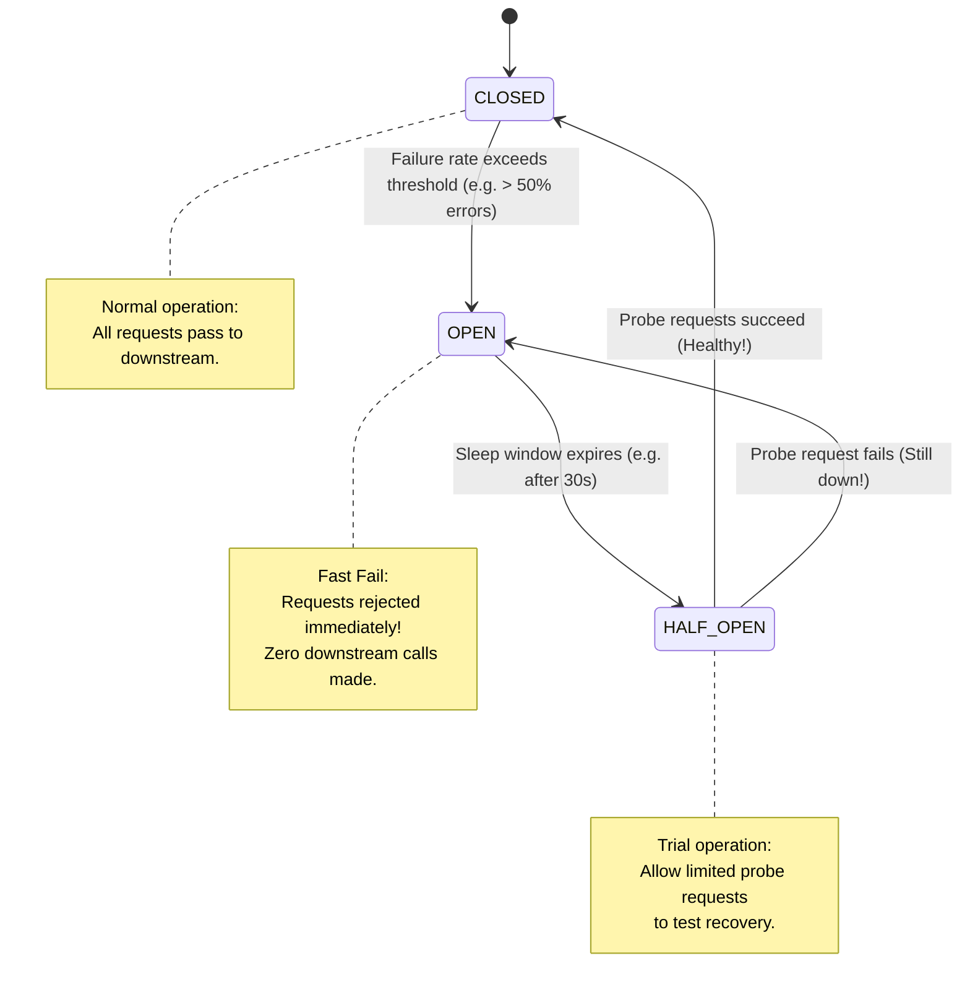

import { Callout } from 'fumadocs-ui/components/callout';
import { Tabs, Tab } from 'fumadocs-ui/components/tabs';
import { Steps, Step } from 'fumadocs-ui/components/steps';
import { Cards, Card } from 'fumadocs-ui/components/card';

## Surviving Catastrophic Failure

In cloud computing, hardware failure is not an anomaly; it is an invariant law of physics. 

Data centers experience backhoe fiber cuts, transformer fires, cooling tower failures, and catastrophic regional networking route flaps.

Designing for **High Availability (HA)** means the system remains operational during routine hardware failures; designing for **Disaster Recovery (DR)** ensures the system survives the complete loss of an entire cloud region or primary data center.

---

## The Foundation Metrics: RPO, RTO & The 9s of Availability

Every disaster recovery plan is governed by two business SLA metrics:



1. **Recovery Point Objective (RPO)**: The maximum acceptable amount of data loss measured in time. An RPO of 5 minutes means you are permitted to lose the last 5 minutes of transactional commits. For flight ticketing and financial settlements, the target RPO is strictly **$\mathbf{0}$ seconds**.
2. **Recovery Time Objective (RTO)**: The maximum acceptable duration of system downtime before the service is restored to customer traffic.

### The Mathematical Cost of "The Nines"

| Availability Tier | Annual Downtime | Monthly Downtime | Daily Downtime | Engineering Complexity |
| :--- | :--- | :--- | :--- | :--- |
| **99.0%** (Two 9s) | $3.65\text{ days}$ | $7.31\text{ hours}$ | $14.4\text{ minutes}$ | Single node, manual backups |
| **99.9%** (Three 9s) | $8.76\text{ hours}$ | $43.8\text{ minutes}$ | $1.44\text{ minutes}$ | Multi-AZ load balancers, auto-failover DB |
| **99.99%** (Four 9s) | $\mathbf{52.6\text{ minutes}}$ | $4.38\text{ minutes}$ | $8.64\text{ seconds}$ | Multi-region Active-Passive, automated failover |
| **99.999%** (Five 9s) | $\mathbf{5.26\text{ minutes}}$ | $26.3\text{ seconds}$ | $864\text{ ms}$ | Multi-region Active-Active, zero single point of failure |
| **99.9999%** (Six 9s) | $\mathbf{31.5\text{ seconds}}$ | $2.63\text{ seconds}$ | $86.4\text{ ms}$ | Planetary distributed consensus (Spanner / Cockroach) |

---

## Multi-Region Deployment Models

When scaling across geographic regions (e.g., `us-east-1` and `eu-west-1`), distributed architectures fall into four distinct operational tiers:

```mermaid
flowchart TD
    subgraph Topologies["Disaster Recovery Topologies (Ordered by Cost & Recovery Speed)"]
        direction TB
        T1["1. Backup & Restore (Cold Standby)<br/>RTO: 12-24 Hours | RPO: 1-24 Hours | Cost: $"]
        T2["2. Pilot Light<br/>RTO: 1-2 Hours | RPO: Minutes | Cost: $$"]
        T3["3. Warm Standby (Active-Passive)<br/>RTO: Minutes | RPO: Seconds | Cost: $$$"]
        T4["4. Active-Active (Multi-Primary)<br/>RTO: 0 Seconds | RPO: 0 Seconds | Cost: $$$$$"]
    end

    style T1 fill:#0f172a,stroke:#64748b,stroke-width:1px
    style T2 fill:#0f172a,stroke:#3b82f6,stroke-width:1px
    style T3 fill:#0f172a,stroke:#f59e0b,stroke-width:2px
    style T4 fill:#0f172a,stroke:#10b981,stroke-width:2px
```

### Deep Dive: Active-Passive vs. Active-Active

<Tabs items={['Warm Standby (Active-Passive)', 'Active-Active Multi-Region']}>
  <Tab value="Warm Standby (Active-Passive)">
    **Topology**: Region A (`us-east-1`) serves 100% of production traffic. Region B (`eu-central-1`) runs a scaled-down mirror of services with read-only database replication.

    - **Pros**: Simple mental model. No distributed multi-master write conflicts. Clean relational consistency.
    - **Cons**: 50% of your paid server infrastructure sits idle doing zero work. When a regional failover occurs, DNS propagation lag can delay recovery.
    - **Failover Sequence**:
      1. Health check probes detect Region A failure.
      2. Promote Region B database replica to Primary.
      3. Scale up Region B application auto-scaling groups from 20% to 100%.
      4. Flip Global DNS / Anycast routing to Region B.
  </Tab>

  <Tab value="Active-Active Multi-Region">
    **Topology**: Both Region A and Region B actively process user writes and reads simultaneously. Users are routed to the physically nearest region.

    - **Pros**: Zero RTO failover (if Region A dies, Anycast BGP reroutes traffic to Region B in seconds). Maximum infrastructure resource utilization.
    - **The Ultimate Challenge (Write Conflicts)**:
      - Transatlantic light speed roundtrip takes $\sim 70-100\text{ ms}$. Synchronous cross-region 2-Phase Commit (2PC) destroys application performance.
      - Asynchronous multi-primary replication leads to **concurrent conflicting writes**: User books Seat 14B in US at the exact millisecond another user books Seat 14B in Europe!
      - **Mitigation**: Partitioning by user/geography, Conflict-Free Replicated Data Types (CRDTs), or Last-Write-Wins (LWW) with synchronized atomic clocks.
  </Tab>
</Tabs>

---

## Global Traffic Routing: BGP Anycast vs. GeoDNS

How does client traffic route to the surviving region during a catastrophic failure?

```mermaid
flowchart TD
    subgraph GeoDNS["GeoDNS Routing (Application Layer)"]
        User1["User Device"] --> DNS["DNS Nameserver"]
        DNS -- "Resolves IP based on Client IP" --> IP_US["Returns US Server IP: 198.51.100.1"]
        Note1["Problem: Client OS & ISP DNS resolvers cache TTLs.<br/>Failover takes 5-30 minutes due to stale caches!"]
    end

    subgraph BGP["BGP Anycast Routing (Network Layer)"]
        User2["User Device"] --> Router["Internet BGP Routers"]
        Router -- "Single Shared Anycast IP: 1.1.1.1" --> EdgeA["PoP US (Shortest AS Path)"]
        Router -. "If US PoP withdraws BGP route" .-> EdgeB["PoP EU (Automatic Network Reroute in < 3s!)"]
    end

    style GeoDNS fill:#0f172a,stroke:#ef4444,stroke-width:1px
    style BGP fill:#0f172a,stroke:#10b981,stroke-width:2px
```



### 1. GeoDNS
- Uses DNS queries to return different IP addresses based on client location.
- **Weakness in Disaster Recovery**: Operating systems, local home Wi-Fi routers, and ISP DNS recursive resolvers frequently ignore low DNS TTLs (Time-To-Live). If a region crashes and you update DNS, up to $20\%$ of users continue hitting the dead IP for 30 minutes.

### 2. BGP Anycast
- The exact same public IP address is announced simultaneously from multiple data centers worldwide via **Border Gateway Protocol (BGP)**.
- Global ISP internet routers automatically route packets to the topologically closest data center using shortest AS-Path.
- **Instant DR Failover**: If Region A fails, the edge router withdraws its BGP route advertisement. The global internet automatically routes subsequent TCP packets to Region B in under 3 seconds—completely bypassing DNS caching!

---

## The Circuit Breaker Pattern

When a downstream dependency (such as an external airline reservation system like Sabre or Amadeus) starts timing out or throwing HTTP 500 errors, naive applications continue retrying.

This exhausts local thread pools, builds unbounded connection backlogs, and collapses your own service (**Cascading Failure**).

Michael Nygard introduced the **Circuit Breaker** pattern in *Release It!* to arrest cascading collapse:



### The Three State Transitions
1. **CLOSED (Healthy)**: Requests pass through normally. Successes and failures are tracked in a sliding window. If failure percentage exceeds a threshold (e.g., $50\%$), the breaker trips to **OPEN**.
2. **OPEN (Tripped / Fast-Fail)**: All requests fail immediately without even opening a socket to the downstream service. Prevents resource exhaustion and returns a fallback response instantly.
3. **HALF-OPEN (Probing)**: After a sleep duration (e.g., 30 seconds), the breaker allows a small number of canary probe requests through. If they succeed, it resets to **CLOSED**; if any probe fails, it trips back to **OPEN**.

---

## TravelBuddy Production Circuit Breaker Implementation

Below is TravelBuddy's production-grade Circuit Breaker written in TypeScript for downstream airline legacy GDS integration:

```typescript
/**
 * TravelBuddy Resiliency Tier: High-Performance Circuit Breaker
 * Protects booking pipelines from downstream third-party airline outages.
 */
enum CircuitState {
  CLOSED = "CLOSED",
  OPEN = "OPEN",
  HALF_OPEN = "HALF_OPEN"
}

interface CircuitBreakerOptions {
  failureThresholdPct: number; // e.g. 50%
  rollingWindowMs: number;     // e.g. 10000ms (10s)
  minRequestsInWindow: number; // e.g. 20
  sleepWindowMs: number;       // e.g. 30000ms (30s)
}

export class CircuitBreaker {
  private state: CircuitState = CircuitState.CLOSED;
  private failures: number = 0;
  private totalRequests: number = 0;
  private lastStateChanged: number = Date.now();
  private windowStart: number = Date.now();

  constructor(
    private readonly name: string,
    private readonly options: CircuitBreakerOptions
  ) {}

  public async execute<T>(action: () => Promise<T>, fallback: () => Promise<T>): Promise<T> {
    const now = Date.now();
    this.evaluateState(now);

    if (this.state === CircuitState.OPEN) {
      // Fast-fail immediately without touching downstream
      return fallback();
    }

    try {
      this.totalRequests++;
      const result = await action();
      this.recordSuccess();
      return result;
    } catch (error) {
      this.recordFailure();
      return fallback();
    }
  }

  private evaluateState(now: number): void {
    // Check if sleep window expired for OPEN circuit
    if (this.state === CircuitState.OPEN) {
      if (now - this.lastStateChanged >= this.options.sleepWindowMs) {
        this.state = CircuitState.HALF_OPEN;
        this.lastStateChanged = now;
      }
    }

    // Reset rolling sliding window metrics
    if (now - this.windowStart >= this.options.rollingWindowMs) {
      this.windowStart = now;
      this.failures = 0;
      this.totalRequests = 0;
    }
  }

  private recordSuccess(): void {
    if (this.state === CircuitState.HALF_OPEN) {
      // Canary probe succeeded; heal circuit
      this.state = CircuitState.CLOSED;
      this.lastStateChanged = Date.now();
      this.failures = 0;
      this.totalRequests = 0;
    }
  }

  private recordFailure(): void {
    this.failures++;
    const failurePct = (this.failures / this.totalRequests) * 100;

    if (this.state === CircuitState.HALF_OPEN) {
      // Canary probe failed; trip open immediately
      this.state = CircuitState.OPEN;
      this.lastStateChanged = Date.now();
      return;
    }

    if (
      this.totalRequests >= this.options.minRequestsInWindow &&
      failurePct >= this.options.failureThresholdPct
    ) {
      this.state = CircuitState.OPEN;
      this.lastStateChanged = Date.now();
    }
  }

  public getState(): CircuitState {
    return this.state;
  }
}
```

---

## Architectural Rules of Thumb

1. **Know Your RPO and RTO Contract**: Never build a complex, multi-million-dollar Active-Active system if the business SLA permits a 4-hour RTO with Warm Standby.
2. **Beware of Health Check Hysteresis (Flap Damping)**: If a health check flips a DNS record after 1 dropped ping, network jitter will cause continuous flapping, creating a thundering herd. Require at least $3$ consecutive failed probes before tripping and $5$ consecutive successful probes before restoring.
3. **Always Combine Circuit Breakers with Fallbacks**: Fast-failing is only valuable if the client receives a degraded, helpful response (e.g., returning cached flight schedules from 10 minutes ago with a banner: *“Live pricing temporarily unavailable”*).
4. **Test Disaster Recovery in Production (Chaos Engineering)**: An untested disaster recovery runbook is guaranteed to fail. Periodically inject simulated regional outages using tools like Chaos Mesh or AWS Fault Injection Simulator.
