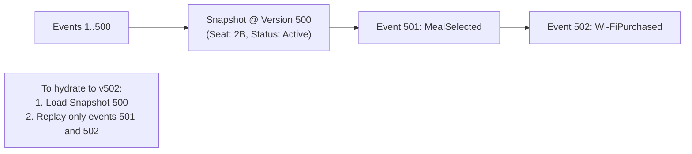

import { Callout } from 'fumadocs-ui/components/callout';
import { Tabs, Tab } from 'fumadocs-ui/components/tabs';
import { Steps, Step } from 'fumadocs-ui/components/steps';
import { Cards, Card } from 'fumadocs-ui/components/card';

## The Dual-Workload Dilemma in Scaling Systems

Traditional architectures rely on a single unified data model for both writes and reads. In this classical model, an incoming HTTP request triggers an in-place `UPDATE` on a row in a relational database, and incoming read queries execute joins across the same tables:

```mermaid
flowchart LR
    Client["Client / API"] -->|Reads & Writes| DB[("Single Relational Model<br/>(PostgreSQL)")]
    
    style DB fill:#0f172a,stroke:#ef4444,stroke-width:2px
```



At scale, this architecture faces severe structural tension:
1. **Write Models Require High Normalization**: To prevent anomalies, ensure ACID invariants, and preserve relational integrity, writes demand 3rd Normal Form ($3\text{NF}$) with fine-grained foreign keys and row locks.
2. **Read Models Require Aggressive Denormalization**: High-throughput read dashboards, customer booking summaries, and complex searches need flat, pre-computed document structures that avoid multi-table joins.
3. **Lock Contention**: Heavy analytical read queries block or compete with high-frequency transactional updates on hot rows.

To decouple these competing forces, high-scale distributed architectures employ **CQRS (Command Query Responsibility Segregation)** and **Event Sourcing**.

---

## 1. CQRS: Command Query Responsibility Segregation

Formulated by Greg Young and Bertrand Meyer (originating from Command-Query Separation), CQRS splits the application into two distinct paths:

```mermaid
flowchart TD
    subgraph WriteSide["Command Side (Write / Mutation)"]
        CmdAPI["Write API / Command Handler"] --> DomainLogic["Domain Validation & Invariants"]
        DomainLogic --> WriteDB[("Write Store<br/>(Transactional OLTP / Event Store)")]
    end

    subgraph Sync["Async Projection Engine"]
        WriteDB -->|CDC / Event Bus / Kafka| Projector["Projection Workers"]
        Projector --> ReadDB[("Read Models<br/>(Elasticsearch, Redis, Read-Replicas)")]
    end

    subgraph ReadSide["Query Side (Read / Views)"]
        QueryAPI["Query API / Query Handler"] --> ReadDB
    end

    Client["Client Applications"] -->|"Commands (POST / PUT / DELETE)"| CmdAPI
    Client -->|"Queries (GET)"| QueryAPI

    style WriteSide fill:#020617,stroke:#3b82f6,stroke-width:2px
    style Sync fill:#020617,stroke:#10b981,stroke-width:2px
    style ReadSide fill:#020617,stroke:#8b5cf6,stroke-width:2px
```



### Commands vs. Queries

| Attribute | Command (`Write`) | Query (`Read`) |
|---|---|---|
| **Intent** | Mutates state, expresses business intent (e.g., `BookFlightSeat`) | Retrieves state without modifying it (e.g., `GetFlightManifest`) |
| **Return Value** | Success/failure, tracking ID, or generated version; does **not** return full state | Returns structured view models (DTOs) |
| **Validation** | Strict business logic invariants, transactional integrity | Minimal to none; schema filtering and pagination |
| **Data Model** | Normalized OLTP tables or append-only event streams | Denormalized, pre-joined documents (Elasticsearch, Redis, PostgreSQL views) |
| **Scaling** | Optimized for write latency, serialization, and consistency | Horizontally scaled across distributed caches and read replicas |

---

## 2. Event Sourcing: State as a Stream of Events

While CQRS separates read and write models, **Event Sourcing** changes how state is persisted on the write side.

Instead of storing the *current snapshot* of an entity by mutating rows in place (`UPDATE tickets SET status = 'CANCELLED'`), the system records every state change as an immutable, append-only domain event:

```mermaid
flowchart LR
    subgraph InPlace["Traditional In-Place Mutation"]
        S1["Status: CONFIRMED"] -->|UPDATE| S2["Status: CANCELLED"]
        note1["Prior history is overwritten and lost!"]
    end

    subgraph EventStream["Event Sourcing (Append-Only Log)"]
        E1["1. FlightBooked<br/>(Seat 14A, $450)"] --> E2["2. PassengerCheckedIn<br/>(Bags: 1)"]
        E2 --> E3["3. SeatUpgraded<br/>(To 2B, +$150)"]
        E3 --> E4["4. FlightCancelled<br/>(Refund Issued)"]
    end

    style InPlace fill:#0f172a,stroke:#ef4444,stroke-width:2px
    style EventStream fill:#0f172a,stroke:#10b981,stroke-width:2px
```



### Reconstructing Current State

The current state of any entity (aggregate) is computed by replaying its historical events from inception:

$$\text{Current State} = \sum_{i=0}^{N} \text{Apply}(\text{Event}_i)$$

Or in functional programming terms:
$$\text{Current State} = \text{foldl}(\text{applyEvent}, \text{InitialState}, \text{EventStream})$$

---

## 3. Mitigating the Replay Bottleneck: Snapshots

If an entity like a high-frequency flight booking ledger accumulates 50,000 events, replaying the entire stream from offset zero on every write introduces unacceptable latency ($O(N)$ event deserialization).

**The Solution: Periodic Snapshotting**:
A background daemon or inline worker records the state of the entity every $K$ events (e.g., every 500 events):



Hydration time drops from $O(N)$ to $O(N \pmod K)$, providing sub-millisecond aggregate loading regardless of total stream length.

---

## 4. Production Implementation: Event-Sourced Flight Aggregate in Python

Here is a production-grade implementation of an event-sourced aggregate with optimistic concurrency control (version fencing) and snapshotting:

```python
from dataclasses import dataclass, field
from datetime import datetime
from typing import List, Optional
import json

# --- 1. Domain Events ---

@dataclass(frozen=True)
class DomainEvent:
    aggregate_id: str
    version: int
    timestamp: str

@dataclass(frozen=True)
class FlightBookedEvent(DomainEvent):
    passenger_id: str
    seat_number: str
    price_cents: int

@dataclass(frozen=True)
class SeatUpgradedEvent(DomainEvent):
    new_seat_number: str
    upgrade_fee_cents: int

@dataclass(frozen=True)
class FlightCancelledEvent(DomainEvent):
    reason: str
    refund_amount_cents: int


# --- 2. Aggregate Root (FlightReservation) ---

class FlightReservationAggregate:
    def __init__(self, reservation_id: str):
        self.id: str = reservation_id
        self.version: int = 0
        self.passenger_id: Optional[str] = None
        self.seat_number: Optional[str] = None
        self.total_paid_cents: int = 0
        self.status: str = "NEW"
        self._uncommitted_events: List[DomainEvent] = []

    def apply_event(self, event: DomainEvent) -> None:
        """Hydrates state from an event without generating new uncommitted changes."""
        if isinstance(event, FlightBookedEvent):
            self.passenger_id = event.passenger_id
            self.seat_number = event.seat_number
            self.total_paid_cents = event.price_cents
            self.status = "CONFIRMED"
        elif isinstance(event, SeatUpgradedEvent):
            self.seat_number = event.new_seat_number
            self.total_paid_cents += event.upgrade_fee_cents
        elif isinstance(event, FlightCancelledEvent):
            self.status = "CANCELLED"
            self.total_paid_cents -= event.refund_amount_cents
            
        self.version = event.version

    def book(self, passenger_id: str, seat: str, price: int) -> None:
        if self.status != "NEW":
            raise ValueError(f"Reservation {self.id} already exists with status {self.status}")
        
        event = FlightBookedEvent(
            aggregate_id=self.id,
            version=self.version + 1,
            timestamp=datetime.utcnow().isoformat(),
            passenger_id=passenger_id,
            seat_number=seat,
            price_cents=price
        )
        self.apply_event(event)
        self._uncommitted_events.append(event)

    def upgrade_seat(self, new_seat: str, upgrade_fee: int) -> None:
        if self.status != "CONFIRMED":
            raise ValueError(f"Cannot upgrade booking in state: {self.status}")
        
        event = SeatUpgradedEvent(
            aggregate_id=self.id,
            version=self.version + 1,
            timestamp=datetime.utcnow().isoformat(),
            new_seat_number=new_seat,
            upgrade_fee_cents=upgrade_fee
        )
        self.apply_event(event)
        self._uncommitted_events.append(event)

    def get_uncommitted_events(self) -> List[DomainEvent]:
        events = list(self._uncommitted_events)
        self._uncommitted_events.clear()
        return events


# --- 3. Event Store with Optimistic Concurrency ---

class EventStore:
    def __init__(self):
        # In-memory backing: aggregate_id -> List[DomainEvent]
        self._storage: dict[str, List[DomainEvent]] = {}

    def append(self, aggregate_id: str, events: List[DomainEvent], expected_version: int) -> None:
        current_events = self._storage.get(aggregate_id, [])
        current_version = current_events[-1].version if current_events else 0

        # Optimistic Concurrency Check
        if current_version != expected_version:
            raise RuntimeError(
                f"Concurrency Conflict! Expected version {expected_version}, but found {current_version}"
            )

        if aggregate_id not in self._storage:
            self._storage[aggregate_id] = []
        self._storage[aggregate_id].extend(events)

    def load_stream(self, aggregate_id: str) -> List[DomainEvent]:
        return self._storage.get(aggregate_id, [])
```

---

## 5. Architectural Trade-offs & Production Realities

<Tabs items={['Advantages', 'Operational Challenges', 'When NOT to Use']}>
  <Tab value="Advantages">
    - **100% Audit Fidelity**: You never lose data to `UPDATE` overwrites. You can inspect exact account balances or booking statuses at any given second in history (*Time-Travel Debugging*).
    - **Zero Write Lock Contention**: Appending to an immutable log eliminates row-level read-write deadlocks.
    - **Independent Scalability**: Read projections can be scaled independently using Elasticsearch, Redis, or read replicas without touching the primary event store.
    - **Extensibility**: When business requirements change (e.g., adding a new fraud detection projection), you do not perform dangerous database migrations; you simply create a new consumer and replay historical events from offset zero.
  </Tab>
  <Tab value="Operational Challenges">
    - **Eventual Consistency Latency**: When a user books a flight, their immediate subsequent `GET /api/reservations` may hit a read projection that has not yet processed the new event. Mitigate via **Read-Your-Own-Writes routing** or client version tokens.
    - **Event Schema Evolution**: Events are immutable; you cannot alter events emitted 3 years ago. Schema changes require upcasters or versioned event handlers (`FlightBookedV1` vs `FlightBookedV2`).
    - **System Complexity**: High cognitive and operational overhead. Managing projection workers, backpressures, and out-of-order event delivery requires mature telemetry.
  </Tab>
  <Tab value="When NOT to Use">
    - Simple CRUD applications with symmetric read/write models.
    - Systems where business rules require immediate cross-aggregate strong consistency across dozens of entities without distributed sagas.
    - Teams lacking operational experience with event-driven pipelines and message brokers.
  </Tab>
</Tabs>

---

## Architectural Rules of Thumb

1. **Keep Commands Void of Query Data**: A command handler should return an acknowledgment, correlation ID, or stream version—not the reconstructed aggregate view.
2. **Never Mutate an Emitted Event**: Once an event enters the event log, it is a permanent historical fact. If an error occurs, emit a compensating event (`ReservationFailed`, `RefundIssued`).
3. **Partition Projections by Aggregate ID**: Route all events for a given `reservation_id` to the same partition in your event bus (e.g., Kafka key) to guarantee strict in-order processing on projection workers.
4. **Enforce Optimistic Concurrency Control**: Always persist the `expected_version` with incoming events to prevent lost updates when concurrent commands target the same aggregate.
