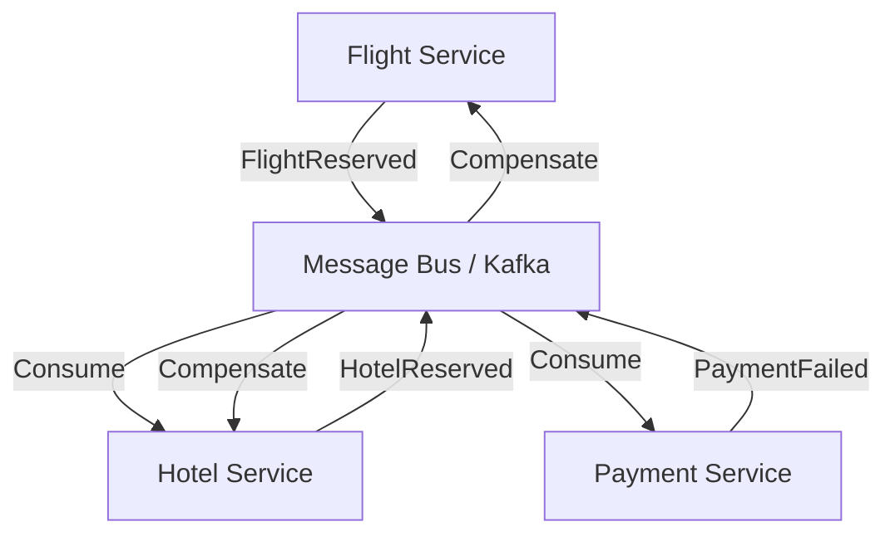
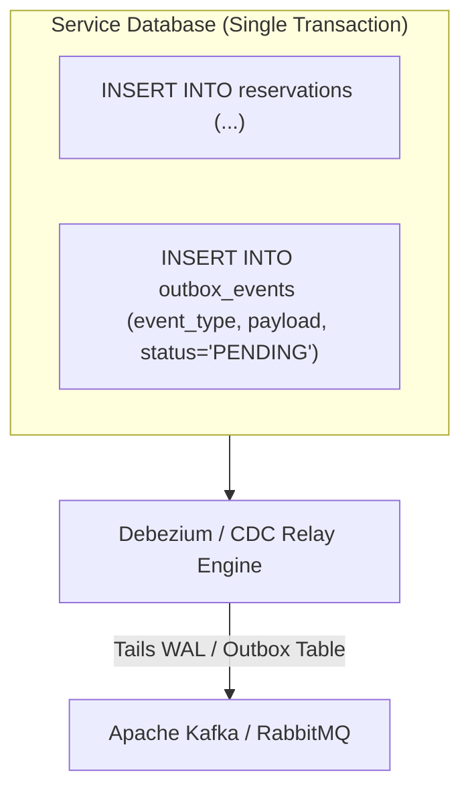

import { Callout } from 'fumadocs-ui/components/callout';
import { Tabs, Tab } from 'fumadocs-ui/components/tabs';
import { Steps, Step } from 'fumadocs-ui/components/steps';
import { Cards, Card } from 'fumadocs-ui/components/card';

## Why 2PC Fails in Microservices

In monolithic architectures, maintaining consistency across multiple entities is trivial: wrapping statements in `BEGIN TRANSACTION` and `COMMIT` guarantees ACID properties.

In distributed microservice architectures, however, a single business workflow—such as booking a travel itinerary—spans multiple isolated databases:
- **Flight Service** (PostgreSQL)
- **Hotel Service** (MySQL)
- **Payment Gateway** (Stripe / External API)
- **Notification Service** (Redis / SQS)


### The Failure of Two-Phase Commit (2PC)

Traditional distributed databases use **Two-Phase Commit (2PC)**. However, 2PC is fundamentally unviable across modern cloud microservices:
1. **Blocking Protocol**: If the coordinator or any participant crashes during the *Prepare* phase, cohorts hold database locks indefinitely, starving connection pools.
2. **Latency Tax**: Every service must execute synchronous RPC round-trips before releasing row locks. Across multi-region cloud networks, tail latency explodes ($O(\max(t_{\text{cohort}}))$).
3. **Incompatible with 3rd-Party APIs**: External payment providers (like Stripe or PayPal) do not support the XA/2PC protocol.

The industry-standard solution is the **Saga Pattern** (Garcia-Molina & Salem, 1987).

---

## 1. What Is a Saga?

A **Saga** is a sequence of local transactions:

$$T_1, T_2, T_3, \dots, T_n$$

- Each transaction $T_i$ updates data within a single microservice and publishes an event or message.
- If a local transaction $T_k$ fails (e.g., credit card payment declined), the Saga executes a series of **Compensating Transactions**:

$$C_{k-1}, C_{k-2}, \dots, C_1$$

Compensating transactions undo the side effects of previous transactions in reverse order, restoring application-level consistency without distributed locks.

```mermaid
flowchart LR
    T1["T1: Reserve Flight"] --> T2["T2: Reserve Hotel"]
    T2 --> T3["T3: Process Payment<br/>(FAILS!)"]
    T3 -.->|Compensate| C2["C2: Cancel Hotel"]
    C2 -.->|Compensate| C1["C1: Release Flight"]

    style T1 fill:#0f172a,stroke:#3b82f6,stroke-width:2px
    style T2 fill:#0f172a,stroke:#3b82f6,stroke-width:2px
    style T3 fill:#0f172a,stroke:#ef4444,stroke-width:2px
    style C2 fill:#0f172a,stroke:#f59e0b,stroke-width:2px
    style C1 fill:#0f172a,stroke:#f59e0b,stroke-width:2px
```



---

## 2. Choreography vs. Orchestration Sagas

There are two primary paradigms for coordinating a saga:

### Pattern A: Choreography (Event-Driven Decentralization)

Services communicate implicitly by subscribing to domain events published to a message bus (e.g., Kafka, RabbitMQ). No central coordinator exists:



- **Pros**: Simple to set up for small workflows (2–3 steps); loose coupling.
- **Cons**: Becomes an unmaintainable "spaghetti architecture" at scale; circular dependencies; tracing failure paths across 10+ services is nearly impossible.

---

### Pattern B: Orchestration (Centralized State Machine)

A dedicated **Saga Orchestrator** (often backed by Temporal, AWS Step Functions, or custom state machine engines) explicitly controls each step, dispatching commands and tracking transaction states:

```mermaid
flowchart TD
    Orch["Saga Orchestrator<br/>(State Machine)"]
    
    Orch -->|"1. ReserveFlight"| Flight["Flight Service"]
    Flight -->|"2. FlightReserved"| Orch
    
    Orch -->|"3. ReserveHotel"| Hotel["Hotel Service"]
    Hotel -->|"4. HotelReserved"| Orch
    
    Orch -->|"5. ChargePayment"| Pay["Payment Service"]
    Pay -->|"6. PaymentDeclined"| Orch
    
    Orch -.->"7. CancelHotel"| Hotel
    Orch -.->"8. ReleaseFlight"| Flight

    style Orch fill:#020617,stroke:#a855f7,stroke-width:3px
```

- **Pros**: Centralized visibility; simple error handling; clear definition of compensating paths; prevents cyclic dependency hell.
- **Cons**: Single point of coordination; requires robust persistence of the orchestrator's state.

---

## 3. The Transactional Outbox Pattern

A fundamental trap in distributed sagas is the **Dual-Write Hazard**:

```python
# BUGGY DUAL-WRITE CODE:
db.commit()            # Step 1: Write to local database
kafka.produce(event)   # Step 2: Publish event to Kafka
```

If the service crashes between Step 1 and Step 2, the database mutation succeeds, but the message is never published. The saga stalls forever.

### The Solution: Transactional Outbox

Instead of writing to Kafka directly, write the domain entity AND the outbound event into the **same local database within a single atomic ACID transaction**:



1. The service commits both the business entity and the outbox row atomically.
2. A Transaction Log Miner (e.g., Debezium CDC) reads the database write-ahead log (WAL) and delivers the event to Kafka with **at-least-once** guarantees.
3. Downstream services enforce **Idempotency** via unique transaction/event keys.

---

## 4. Production Orchestrator Implementation in TypeScript

Here is a resilient Saga Orchestrator state machine pattern handling execution, compensation, and idempotency:

```typescript
type StepStatus = 'PENDING' | 'SUCCESS' | 'FAILED' | 'COMPENSATED';

interface SagaStep<TContext> {
  name: string;
  execute: (context: TContext) => Promise<void>;
  compensate: (context: TContext) => Promise<void>;
}

export class TravelBookingSagaOrchestrator {
  private executedSteps: SagaStep<any>[] = [];

  async runSaga<TContext>(steps: SagaStep<TContext>[], context: TContext): Promise<boolean> {
    for (const step of steps) {
      try {
        console.log(`[Saga] Executing step: ${step.name}`);
        await step.execute(context);
        this.executedSteps.push(step);
      } catch (error) {
        console.error(`[Saga] Step ${step.name} failed:`, error);
        await this.rollback(context);
        return false;
      }
    }
    console.log('[Saga] Completed successfully!');
    return true;
  }

  private async rollback<TContext>(context: TContext): Promise<void> {
    console.warn('[Saga] Initiating compensating rollback sequence...');
    // Compensate in reverse order of execution
    const rollbackSteps = [...this.executedSteps].reverse();

    for (const step of rollbackSteps) {
      try {
        console.log(`[Saga Rollback] Compensating: ${step.name}`);
        await step.compensate(context);
      } catch (compensateError) {
        // Critical: Compensations must be idempotent and retried until resolved
        console.error(`[CRITICAL] Compensation failed for ${step.name}! Log to dead-letter queue:`, compensateError);
      }
    }
  }
}
```

---

## Architectural Rules of Thumb

1. **Compensating Transactions Must Be Idempotent**: A compensation function may be executed multiple times during network retries or worker restarts. Always guard them with idempotency tokens.
2. **Account for Semantic Data Anomalies**: Because Sagas lack isolation ($ACID \to ACD$), intermediate updates are visible to other concurrent users. Use reservation holds (e.g., *Pending Payment*) to prevent dirty read side-effects.
3. **Prefer Orchestration Beyond 3 Services**: As soon as a transaction workflow touches 3 or more microservices, transition from choreography to orchestration to prevent distributed coordination blindspots.
4. **Always Pair Sagas with the Outbox Pattern**: Never attempt direct network calls to a message bus inside or right after a local database transaction.
