import { Callout } from 'fumadocs-ui/components/callout';
import { Tabs, Tab } from 'fumadocs-ui/components/tabs';
import { Steps, Step } from 'fumadocs-ui/components/steps';
import { Cards, Card } from 'fumadocs-ui/components/card';

## The Production Engineering Playbook

Designing distributed systems in production or in senior/staff system design interviews requires moving beyond hand-wavy architecture diagrams. 

A principal systems architect does not simply say: *“We will put a cache here and a queue there.”* They ask:
- *“What is our peak QPS, and how many Redis cluster nodes are required to absorb that ingress without eviction?”*
- *“When a holiday promotion expires, how do we prevent 50,000 concurrent requests from stampeding the PostgreSQL primary?”*
- *“Which rate limiting algorithm preserves burstiness without opening memory-exhaustion attack vectors?”*
- *“What is our RPO and RTO when an AWS availability zone suffers an underground fiber severance?”*

```mermaid
flowchart TD
    subgraph Quant["1. Quantitative Sizing"]
        M1["Back-of-the-Envelope Math"] --> M2["Storage, RAM & Bandwidth Sizing"]
    end

    subgraph Protection["2. Perimeter Defense"]
        P1["API Gateway & Reverse Proxy"] --> P2["Distributed Token / Leaky Buckets"]
    end

    subgraph Resilience["3. Resilient Data Tier"]
        C1["Cache-Aside & XFetch Algorithm"] --> C2["Bloom Filters & Stampede Locks"]
    end

    subgraph Survivability["4. Disaster Recovery"]
        D1["Active-Active Multi-Region"] --> D2["Circuit Breakers & Anycast DNS"]
    end

    Quant --> Protection --> Resilience --> Survivability

    style Quant fill:#0f172a,stroke:#38bdf8,stroke-width:2px
    style Protection fill:#0f172a,stroke:#ec4899,stroke-width:2px
    style Resilience fill:#0f172a,stroke:#10b981,stroke-width:2px
    style Survivability fill:#0f172a,stroke:#f59e0b,stroke-width:2px
```

This track provides concrete mathematical formulas, battle-tested algorithms, production Redis Lua scripts, and high-availability blueprints implemented across **TravelBuddy**'s 50-million-user global platform.

---

## Cookbook Chapters & Navigation

<Cards>
  <Card
    title="01: Capacity Estimation & Back-of-the-Envelope Math"
    href="/docs/system-design/05-cookbook/01-capacity-estimation-and-back-of-the-envelope-math"
    icon="Cpu"
    description="Powers of two, Jeff Dean latency numbers, QPS formulas, 5-year storage growth, bandwidth calculations, and the 80/20 Pareto caching rule with a full 50M DAU worked case study."
  />
  <Card
    title="02: Rate Limiting & API Gateways"
    href="/docs/system-design/05-cookbook/02-rate-limiting-and-api-gateways"
    icon="Activity"
    description="The 5 algorithms compared: Token Bucket, Leaky Bucket, Fixed Window, Sliding Window Log, and Sliding Window Counter. Production Redis Lua script and API Gateway architecture."
  />
  <Card
    title="03: Distributed Caching & Cache Stampede"
    href="/docs/system-design/05-cookbook/03-distributed-caching-and-cache-stampede"
    icon="Layers"
    description="Mitigating thundering herds, cache penetration, and cache breakdown: Mutex locking, the probabilistic XFetch algorithm, Bloom filters, and jittered TTL expiration."
  />
  <Card
    title="04: Disaster Recovery & High Availability"
    href="/docs/system-design/05-cookbook/04-disaster-recovery-and-high-availability"
    icon="Compass"
    description="RPO vs RTO, calculating 9s of availability, Active-Passive vs Active-Active multi-region models, Anycast routing, and Circuit Breaker state machines."
  />
  <Card
    title="05: CQRS & Event Sourcing"
    href="/docs/system-design/05-cookbook/05-cqrs-and-event-sourcing"
    icon="RefreshCw"
    description="Command Query Responsibility Segregation, immutable event stores, aggregate hydration, periodic snapshotting, and managing eventual consistency latency."
  />
  <Card
    title="06: The Saga Pattern & Distributed Transactions"
    href="/docs/system-design/05-cookbook/06-saga-pattern-and-distributed-transactions"
    icon="GitFork"
    description="Multi-service transactions without 2PC: Choreography vs Orchestration sagas, compensating transaction rollbacks, and the Transactional Outbox pattern."
  />
</Cards>
