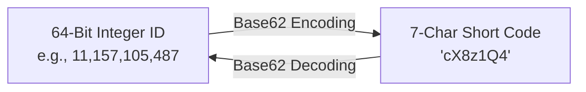

import { Callout } from 'fumadocs-ui/components/callout';
import { Tabs, Tab } from 'fumadocs-ui/components/tabs';
import { Steps, Step } from 'fumadocs-ui/components/steps';
import { Cards, Card } from 'fumadocs-ui/components/card';

## 1. Requirements & Scope Clarification

Designing a URL shortener like **TinyURL** or **Bitly** is the definitive introductory system design interview problem. It tests capacity estimation, encoding mathematics, high read-to-write ratio caching, and persistent key-value storage.

### Functional Requirements
1. **Shorten URL**: Given a long URL (e.g., `https://travelbuddy.com/flights/international/specials?deal=blackfriday`), generate a unique 7-character alias (e.g., `https://tiny.url/aZ9x4Q1`).
2. **Redirect**: When accessing `https://tiny.url/{alias}`, redirect the client to the original long URL with sub-50ms latency.
3. **Custom Aliases & Expiration**: Allow users to provide a custom alias (optional) and configure an expiration TTL (default: 5 years).
4. **Analytics**: Track click count, referral domains, and geographic access metrics.

### Non-Functional Requirements
- **High Availability**: $99.99\%$ availability ($52.6$ minutes downtime/year). The redirection service must never fail.
- **Ultra-Low Latency**: Redirection reads must respond in $< 20\text{ms}$.
- **Unpredictability**: Short URLs should not be easily guessable (prevent enumeration scraping).

---

## 2. Capacity Estimation & Quantitative Sizing

### Traffic (QPS)
- **New Short URLs per Month**: $100\text{ Million}$ write requests.
- **Read-to-Write Ratio**: $100:1$ (URLs are created once, shared on Twitter/SMS, and clicked many times).
- **Redirection Reads per Month**: $100\text{M} \times 100 = 10\text{ Billion reads/month}$.

$$\text{Write QPS} = \frac{100{,}000{,}000}{30 \times 86{,}400} \approx \frac{10^8}{2.59 \times 10^6} \approx 38.6 \implies \mathbf{40\text{ writes/sec}}$$

$$\text{Peak Write QPS} = 40 \times 3 = \mathbf{120\text{ writes/sec}}$$

$$\text{Read QPS} = 40 \times 100 = \mathbf{4{,}000\text{ reads/sec}}$$

$$\text{Peak Read QPS} = 4{,}000 \times 2.5 = \mathbf{10{,}000\text{ reads/sec}}$$

---

### Storage Sizing (5-Year Retention)
- Total URLs over 5 years: $100\text{M/month} \times 12 \times 5 = 6\text{ Billion records}$.
- Size per record:
  - `short_hash`: 7 bytes
  - `original_url`: ~500 bytes (average URL length)
  - `created_at`: 8 bytes
  - `expires_at`: 8 bytes
  - `user_id`: 16 bytes (UUID)
  - Metadata & Index Overhead: ~100 bytes
  - **Total per record**: $\approx 640\text{ bytes}$.

$$\text{Total 5-Year Storage} = 6 \times 10^9 \times 640\text{ bytes} \approx 3.84\text{ TB}$$

With $3\times$ cross-region replication and backup indexing:
$$\text{Production Disk Capacity} = 3.84\text{ TB} \times 3 \approx \mathbf{11.5\text{ TB}}$$
*(Easily managed on a replicated NoSQL key-value cluster or partitioned PostgreSQL).*

---

### Memory (Cache) Sizing
Using the **80/20 Pareto Principle**: $20\%$ of the URLs generate $80\%$ of daily read traffic.
- Daily read count: $\frac{10\text{B}}{30} \approx 333\text{M reads/day}$.
- Cached URLs: $333\text{M} \times 20\% \approx 66.6\text{M URLs}$.
- RAM required: $66.6\text{M} \times 640\text{ bytes} \approx 42.6\text{ GB RAM}$.
- With 25% memory overhead margin:
$$\text{Redis Cache RAM} \approx \mathbf{53.25\text{ GB}}$$
*(Two 32-GB AWS `cache.r6g.xlarge` Redis nodes in cluster mode).*

---

## 3. Encoding & Alias Generation Mechanics

A short URL path consists of alphanumeric characters. 

Using **Base62** encoding ($[\text{a-z}, \text{A-Z}, \text{0-9}]$):
- $62^6 \approx 56.8\text{ Billion}$ unique combinations.
- $62^7 = 3.52\text{ Trillion}$ unique combinations.

A **7-character Base62 string** provides ample runway for $6\text{ Billion}$ URLs without collision risk.

### Approach 1: Hash of Long URL (MD5 / Murmur3)
1. Hash `long_url` using MurmurHash3 or MD5:
   $$\text{MD5} \to \text{"9b105d5b166fcb24..."}$$
2. Take the first 7 characters: `9b105d5`.
3. **The Fatal Flaw**: Hash collisions! If two users shorten different URLs that produce identical 7-character prefixes, the system must append a counter and retry, leading to database lookup cascades.

---

### Approach 2: Distributed ID Generator + Base62 Encoding (Recommended)

Instead of hashing the string, assign every URL a unique 64-bit integer ID and convert that integer directly into Base62:



Because every generated ID is globally unique, **mathematically zero hash collisions can ever occur**.

### Base62 Conversion Algorithm in Python

```python
BASE62 = "0123456789abcdefghijklmnopqrstuvwxyzABCDEFGHIJKLMNOPQRSTUVWXYZ"

def encode_base62(num: int) -> str:
    """Converts a 64-bit integer ID into a Base62 alphanumeric string."""
    if num == 0:
        return BASE62[0]
    
    chars = []
    base = len(BASE62)
    while num > 0:
        chars.append(BASE62[num % base])
        num //= base
    return "".join(reversed(chars))

def decode_base62(code: str) -> int:
    """Converts a Base62 string back to its original integer ID."""
    base = len(BASE62)
    num = 0
    for char in code:
        num = num * base + BASE62.index(char)
    return num

# Example:
unique_id = 9_876_543_210
short_code = encode_base62(unique_id)
print(f"ID: {unique_id} -> Short Code: '{short_code}' (Length: {len(short_code)})")
# Output: ID: 9876543210 -> Short Code: 'aUKV7M'
```

---

## 4. End-to-End System Architecture

```mermaid
flowchart TD
    subgraph Clients["Clients & Edge"]
        User["User / Mobile Client"]
        CDN["Cloudflare Anycast CDN & WAF<br/>(Edge Caching & Rate Limiting)"]
    end

    subgraph AppTier["Stateless Redirection Service"]
        LB["Application Load Balancer"]
        AppNodes["API Redirection Nodes<br/>(Go / Rust / FastAPI)"]
    end

    subgraph IDTier["Sequence Generator"]
        Snowflake["Distributed Snowflake / Redis Range ID Generator"]
    end

    subgraph DataTier["Storage & Cache"]
        RedisCluster[("Redis Caching Tier<br/>(LRU Eviction / 54 GB RAM)")]
        DB[("Distributed Key-Value Store<br/>(DynamoDB / Cassandra / ScyllaDB)")]
    end

    subgraph AsyncAnalytics["Analytics Pipeline"]
        Kafka["Apache Kafka Event Bus"]
        ClickHouse[("ClickHouse OLAP<br/>(Geo / Referrer / Clicks)")]
    end

    User --> CDN --> LB --> AppNodes
    AppNodes --> IDTier
    AppNodes --> RedisCluster
    RedisCluster -.->|Cache Miss| DB
    AppNodes -.->|Async Click Event| Kafka --> ClickHouse

    style Clients fill:#020617,stroke:#38bdf8,stroke-width:2px
    style AppTier fill:#020617,stroke:#3b82f6,stroke-width:2px
    style DataTier fill:#020617,stroke:#10b981,stroke-width:2px
    style AsyncAnalytics fill:#020617,stroke:#a855f7,stroke-width:2px
```



---

## 5. Critical Interview Deep Dives

### HTTP 301 vs. HTTP 302 Redirect
- **`301 Moved Permanently`**: The browser caches the redirect mapping indefinitely. Subsequent clicks bypass your servers entirely and redirect directly at the client.
  - *Advantage*: Zero server load for repeated clicks.
  - *Disadvantage*: You cannot track click analytics or revoke corrupted/malicious URLs.
- **`302 Found` (or `307 Temporary Redirect`)**: The browser sends every redirect request through your servers.
  - *Advantage*: 100% accurate click analytics and immediate URL expiration enforcement.
  - *Production standard*: Return **`HTTP 302`** when tracking analytics; return **`HTTP 301`** only if server cost reduction supersedes analytics.

### Preventing Hot-Key Cache Stampedes
Celebrity short URLs (e.g., posted on a Twitter account with 80M followers) generate massive traffic spikes:
- Use **Probabilistic Early Expiration (XFetch)** to ensure the cache is refreshed before TTL expiry without distributed mutex deadlocks.
- Deploy an **Origin Shield** at the CDN edge so cache misses from 200 PoPs coalesce into a single upstream request to your backend.

---

## Architectural Rules of Thumb

1. **Prefer Range-Based ID Generation Over Centralized Sequences**: If using Redis for sequence IDs, assign worker nodes pre-allocated ID ranges (e.g., Node 1 gets `1..1,000,000`, Node 2 gets `1,000,001..2,000,000`) to avoid per-write network round-trips.
2. **Sanitize & Validate Incoming Long URLs**: Prevent open redirect vulnerabilities and phishing by checking submitted URLs against Google Safe Browsing APIs at the API gateway.
3. **Partition by Short Hash**: Shard the primary database by `hash(short_key)` to achieve perfectly uniform distribution across all storage nodes.
