import { Callout } from 'fumadocs-ui/components/callout';
import { Tabs, Tab } from 'fumadocs-ui/components/tabs';
import { Steps, Step } from 'fumadocs-ui/components/steps';
import { Cards, Card } from 'fumadocs-ui/components/card';

## 1. Requirements & Scope Clarification

Designing a planet-scale chat platform like **WhatsApp**, **Slack**, or **Discord** tests real-time connection management, stateful gateway routing, and distributed message delivery guarantees.

### Functional Requirements
1. **1-on-1 Direct Messaging**: Low-latency bi-directional messaging between two users with delivery receipts (*Sent*, *Delivered*, *Read*).
2. **Small-to-Medium Group Chats**: Support group chats up to 500 members.
3. **Online Presence Status**: Real-time *Online / Offline* and *Last Seen* indicators.
4. **Push Notifications**: Deliver alerts to offline mobile clients via APNs / FCM.
5. **Multi-Device Synchronization**: Deliver messages consistently across mobile, web, and desktop clients.

### Non-Functional Requirements
- **Ultra-Low Latency**: End-to-end message delivery under $100\text{ms}$.
- **Strict In-Order Delivery**: Messages within a conversation must never appear out of chronological sequence.
- **High Availability**: $99.99\%$ uptime with graceful connection recovery.
- **Zero Data Loss**: Messages must be persisted to durable storage before acknowledgment.

---

## 2. Capacity Estimation & Quantitative Sizing

### Users & Active Connections
- **Daily Active Users (DAU)**: $500\text{ Million}$.
- **Concurrent Connected Users (Peak)**: $100\text{ Million}$ simultaneous open connections.
- **Average Messages per User/Day**: $40\text{ messages/day}$.

$$\text{Daily Message Volume} = 500\text{M} \times 40 = \mathbf{20\text{ Billion messages/day}}$$

$$\text{Average Message QPS} = \frac{20{,}000{,}000{,}000}{86{,}400} \approx \mathbf{231{,}000\text{ msgs/sec}}$$

$$\text{Peak Message QPS} = 231{,}000 \times 2.5 \approx \mathbf{578{,}000\text{ msgs/sec}}$$

---

### Gateway Memory & Connection Sizing (The $C1000K$ Problem)
Each open WebSocket connection requires an OS socket file descriptor and TCP memory buffers (transmit/receive buffers):
- Linux kernel TCP memory per connection: $\sim 10\text{ KB}$ (tuned).
- User-space gateway process memory per connection: $\sim 5\text{ KB}$.
- **Total RAM per active WebSocket**: $\approx 15\text{ KB}$.

$$\text{RAM for 100M Connections} = 100 \times 10^6 \times 15\text{ KB} = 1.5\text{ TB RAM}$$

If each gateway server has $64\text{ GB RAM}$ and handles $1\text{ Million}$ concurrent connections:
$$\text{Gateway Fleet Size} = \frac{100\text{M}}{1\text{M}} = \mathbf{100\text{ Gateway Servers}}$$
*(Using Erlang/Elixir BEAM or Go/Rust epoll architectures).*

---

### Storage Sizing (5-Year History)
- Average message size (text + metadata): $200\text{ bytes}$.
- Daily storage: $20\text{B} \times 200\text{ bytes} = 4\text{ TB/day}$.
- 5-Year storage: $4\text{ TB} \times 365 \times 5 = 7.3\text{ PB}$.
- With $3\times$ replication:
$$\text{Production Storage Capacity} \approx \mathbf{22\text{ PB}}$$
*(Requires wide-column stores like Apache Cassandra or ScyllaDB partitioned by `conversation_id`).*

---

## 3. Communication Protocol Evaluation

| Protocol | Connection Model | Direction | Overhead | Suitability |
|---|---|---|---|---|
| **HTTP Polling** | Short-lived TCP requests | Unidirectional | Massive header tax ($~800\text{B}$ per request) | ❌ Inefficient |
| **HTTP Long Polling** | Held open until timeout | Unidirectional | Periodic reconnections | ⚠️ Fallback only |
| **Server-Sent Events (SSE)** | Persistent HTTP connection | Server $\to$ Client only | Low | ⚠️ Requires separate channel for upstream |
| **WebSockets** | Persistent full-duplex TCP | Bi-directional | 2-byte frame overhead | 🟢 **Optimal for Chat** |

---

## 4. End-to-End System Architecture

```mermaid
flowchart TD
    subgraph Clients["Clients"]
        UserA["User Alice (Sender)"]
        UserB["User Bob (Receiver)"]
    end

    subgraph Edge["Edge & Load Balancing"]
        DNS["GeoDNS / Anycast IP"]
        L4LB["Layer 4 Load Balancer<br/>(HAProxy / AWS NLB)"]
    end

    subgraph GatewayCluster["Stateful WebSocket Gateways"]
        GW1["Gateway Node 1<br/>(Holds Alice's Socket)"]
        GW2["Gateway Node 2<br/>(Holds Bob's Socket)"]
    end

    subgraph ServiceRegistry["Connection Routing Tier"]
        SessionStore[("Redis Cluster / etcd<br/>(user_id -> gateway_node_ip)")]
        PresenceCluster["Presence Service<br/>(Heartbeats & Status)"]
    end

    subgraph MsgBroker["Distributed Messaging Bus"]
        Kafka["Apache Kafka / NATS JetStream"]
    end

    subgraph StorageTier["Data & Push Tier"]
        Cassandra[("ScyllaDB / Cassandra<br/>(Chat History)")]
        PushService["APNs / FCM Push Worker"]
    end

    UserA -->|1. WSS Connection| L4LB --> GW1
    UserB -->|1. WSS Connection| L4LB --> GW2

    GW1 -->|2. Route Message| MsgBroker
    MsgBroker -->|3. Lookup Bob's Node| SessionStore
    MsgBroker -->|4. Persist Msg| Cassandra
    MsgBroker -->|5. Forward to GW2| GW2
    GW2 -->|6. Deliver via Socket| UserB

    MsgBroker -.->|Bob Offline?| PushService

    style Clients fill:#020617,stroke:#38bdf8,stroke-width:2px
    style Edge fill:#020617,stroke:#64748b,stroke-width:1px
    style GatewayCluster fill:#020617,stroke:#3b82f6,stroke-width:2px
    style ServiceRegistry fill:#020617,stroke:#10b981,stroke-width:2px
    style MsgBroker fill:#020617,stroke:#ec4899,stroke-width:2px
    style StorageTier fill:#020617,stroke:#a855f7,stroke-width:2px
```



---

## 5. Critical Interview Deep Dives

### How to Route Messages Between Stateful Gateways
Because WebSockets are stateful, Alice is connected to `Gateway 1` and Bob is connected to `Gateway 2`.
1. Alice sends a message: `{to: "bob", content: "Hey!"}` to `Gateway 1`.
2. `Gateway 1` queries the **Session Store** (Redis):
   $$\text{HGET sessions:bob} \to \text{"10.0.4.12:8080" (Gateway 2)}$$
3. `Gateway 1` forwards the message to `Gateway 2` via an internal RPC channel (gRPC) or Kafka partition.
4. `Gateway 2` locates Bob's active socket in memory and pushes the packet downstream.

---

### Message Ordering Across Distributed Nodes
Never use physical server timestamps (`System.currentTimeMillis()`) to order chat messages; clock skew will scramble conversations.

**The Solution: Per-Conversation Monotonic Sequence IDs**:
- Assign each message a 64-bit sequence ID scoped to the conversation:
  - `(conversation_id, message_seq_id)`
- Storage engines write sequentially to partition tables:
```sql
CREATE TABLE messages (
    conversation_id UUID,
    message_seq_id BIGINT,
    sender_id UUID,
    payload TEXT,
    created_at TIMESTAMP,
    PRIMARY KEY ((conversation_id), message_seq_id)
) WITH CLUSTERING ORDER BY (message_seq_id ASC);
```
Clients fetch messages by specifying `WHERE conversation_id = ? AND message_seq_id > last_seen_id`, guaranteeing gap-free in-order rendering.

---

### Real-Time Online Presence Architecture
Tracking presence for 100M users generates massive write traffic if handled naively:
1. **Heartbeat Protocol**: Clients send a small heartbeat ping (1 byte) every 30 seconds over the existing WebSocket.
2. **TTL in Redis**: The presence service sets a Redis key with a 60-second TTL:
   ```bash
   SETEX presence:user_123 60 "ONLINE"
   ```
3. If the connection drops or the client disconnects without sending 2 consecutive heartbeats, the key expires automatically, transitioning the user to *Offline*.
4. **Presence Fan-Out**: Do not broadcast presence changes to all contacts immediately! Use a **Lazy Fetch** model: only query presence when a user actually opens a conversation thread.

---

## Architectural Rules of Thumb

1. **Terminate TLS at Layer 4**: Terminate TLS at the Layer 4 load balancer or dedicated Envoy edge proxies to offload cryptographic CPU load from WebSocket gateway workers.
2. **Handle Mobile Sleep Gracefully**: Mobile operating systems aggressively freeze background apps. Always support server-side message queuing and fall back to Apple Push Notification service (APNs) and Firebase Cloud Messaging (FCM).
3. **Use Ephemeral Read Receipts**: Store *Delivered* and *Read* status updates as low-overhead bitmasks or sequence pointers rather than updating full message rows in storage.
