import { Callout } from 'fumadocs-ui/components/callout';
import { Tabs, Tab } from 'fumadocs-ui/components/tabs';
import { Steps, Step } from 'fumadocs-ui/components/steps';
import { Cards, Card } from 'fumadocs-ui/components/card';

## 1. Requirements & Scope Clarification

Designing a scalable News Feed system like **Twitter (X)**, **Instagram**, or **Facebook** is one of the most frequent system design interview questions. It explores the trade-offs between asynchronous pre-computation and on-demand aggregation at planet scale.

### Functional Requirements
1. **Publish Post**: A user can create a post containing text (up to 280 characters) and optional media (photos/videos).
2. **View News Feed**: A user can view a personalized, reverse-chronological feed of posts published by users they follow.
3. **Follow / Unfollow**: Users can follow or unfollow other accounts.
4. **Pagination**: Smooth infinite scroll feed loading with low latency.

### Non-Functional Requirements
- **High Read Availability**: $99.99\%$ uptime. Generating the home feed must never fail.
- **Ultra-Fast Feed Latency**: Home feed rendering must return in $< 150\text{ms}$.
- **Near Real-Time Publication**: A newly published post should appear on followers' feeds within 5 seconds.
- **Asymmetric Workload**: Read requests heavily outweigh write requests ($10:1$ to $50:1$).

---

## 2. Capacity Estimation & Quantitative Sizing

### Traffic (QPS)
- **Daily Active Users (DAU)**: $300\text{ Million}$.
- **Average Follows per User**: $200\text{ accounts}$.
- **Posts Published per Day**: $100\text{ Million posts/day}$.
- **Feed Views per User/Day**: $10\text{ times/day}$.

$$\text{Post Write QPS} = \frac{100{,}000{,}000}{86{,}400} \approx \mathbf{1{,}150\text{ writes/sec}}$$

$$\text{Peak Write QPS} = 1{,}150 \times 3 \approx \mathbf{3{,}500\text{ writes/sec}}$$

$$\text{Feed Read QPS} = \frac{300\text{M} \times 10}{86{,}400} = \frac{3{,}000{,}000{,}000}{86{,}400} \approx \mathbf{35{,}000\text{ reads/sec}}$$

$$\text{Peak Read QPS} = 35{,}000 \times 2.5 \approx \mathbf{87{,}500\text{ reads/sec}}$$

---

### Memory (Timeline Cache) Sizing
Instead of generating feeds from scratch on every read, we cache the top **800 post IDs** for each active user's timeline in Redis:
- 800 post IDs $\times 8\text{ bytes} \approx 6.4\text{ KB}$ per user timeline.
- For $300\text{ Million}$ daily active users:

$$\text{Total Timeline RAM} = 300 \times 10^6 \times 6.4\text{ KB} \approx 1.92\text{ TB RAM}$$

With 25% Redis memory overhead:
$$\text{Production Cache RAM} \approx \mathbf{2.4\text{ TB RAM}}$$
*(A cluster of ~40 AWS `cache.r6g.xlarge` nodes with 64 GB RAM each).*

---

## 3. The Core Dilemma: Push vs. Pull Model

The central design decision in a news feed architecture is deciding when to assemble the timeline:

```mermaid
flowchart TD
    subgraph PushModel["1. Fan-Out-on-Write (Push Model)"]
        W1["User Posts Tweet"] --> W2["Async Fan-Out Workers"]
        W2 --> W3["Lookup 200 Followers"]
        W3 --> W4["Inject Post ID into all 200 Timelines in Redis"]
        notePush["Read Time: O(1) Instantaneous<br/>Write Time: High fan-out amplification"]
    end

    subgraph PullModel["2. Fan-Out-on-Read (Pull Model)"]
        R1["User Opens App"] --> R2["Lookup Followed Users"]
        R2 --> R3["Fetch Recent Posts from all Followees"]
        R3 --> R4["Merge & Sort Top 20 by Timestamp"]
        notePull["Write Time: O(1) Trivial<br/>Read Time: O(N) Heavy join & slow latency"]
    end

    style PushModel fill:#020617,stroke:#3b82f6,stroke-width:2px
    style PullModel fill:#020617,stroke:#10b981,stroke-width:2px
```



### The Celebrity Hotspot Problem

In a pure push model, consider what happens when a user with **80 million followers** (e.g., Elon Musk, Cristiano Ronaldo) publishes a tweet:
- A single write triggers **80 million writes** to Redis timeline lists!
- Message queues back up, causing cascading lag for millions of normal users.

---

### The Hybrid Fan-Out Architecture (Production Standard)

Modern systems (including Twitter's real-world architecture) adopt a **Hybrid Model**:

```mermaid
flowchart TD
    Post["User Publishes Post"] --> Check{"Is Author a Celebrity?<br/>(Followers > 20,000)"}

    Check -- "No (Standard User)" --> Push["Fan-Out on Write (Push)<br/>Inject into all followers' Redis timelines"]
    Check -- "Yes (Celebrity)" --> StoreOnly["Write to Post Storage Only<br/>(Do NOT push to 80M inboxes)"]

    Reader["Follower Opens Feed"] --> MergeEngine["Timeline Assembly Engine"]
    MergeEngine --> FetchCached["1. Read Precomputed Timeline from Redis"]
    MergeEngine --> FetchCeleb["2. Query Recent Posts of Followed Celebrities"]
    MergeEngine --> FinalMerge["3. In-Memory K-Way Merge & Rank"]
    FinalMerge --> Display["Render Home Feed to Client"]

    style Check fill:#0f172a,stroke:#eab308,stroke-width:2px
    style Push fill:#0f172a,stroke:#3b82f6,stroke-width:2px
    style StoreOnly fill:#0f172a,stroke:#ef4444,stroke-width:2px
    style MergeEngine fill:#0f172a,stroke:#10b981,stroke-width:2px
```



1. **Standard Users ($< 20\text{k}$ followers)**: Use **Fan-Out on Write**. Posts are pre-computed into followers' Redis timelines.
2. **Celebrity Users ($> 20\text{k}$ followers)**: Use **Fan-Out on Read**. Their posts are stored only once in the primary post store.
3. **Feed Consumption**: When a follower opens their feed, the system fetches their pre-computed Redis timeline, fetches the latest posts from any followed celebrities, and performs a rapid **K-way merge** in memory.

---

## 4. End-to-End System Architecture

```mermaid
flowchart TD
    subgraph ClientLayer["Clients & Edge"]
        User["User App (Mobile/Web)"]
        CDN["CDN (Static Media: Photos & Videos)"]
        LB["Application Load Balancer"]
    end

    subgraph PostIngestion["Post Publishing Tier"]
        PostService["Post Service"]
        MediaService["Media Ingestion Service"]
        S3[("AWS S3 Object Storage<br/>(Raw Media)")]
    end

    subgraph FanOutTier["Asynchronous Fan-Out"]
        Kafka["Kafka: 'new-posts' Topic"]
        FanOutWorker["Fan-Out Worker Cluster"]
        SocialGraph[("Social Graph Service / Neo4j<br/>(Followers / Followees)")]
    end

    subgraph TimelineTier["Timeline Serving Tier"]
        FeedService["News Feed Service"]
        TimelineCache[("Redis Cluster<br/>(User Timelines: Sorted Sets)")]
        PostDB[("Post Storage<br/>(PostgreSQL / Cassandra)")]
    end

    User --> LB --> PostService
    User --> CDN
    PostService --> Kafka
    PostService --> PostDB
    PostService --> MediaService --> S3

    Kafka --> FanOutWorker
    FanOutWorker --> SocialGraph
    FanOutWorker --> TimelineCache

    User --> LB --> FeedService
    FeedService --> TimelineCache
    FeedService --> PostDB

    style ClientLayer fill:#020617,stroke:#38bdf8,stroke-width:2px
    style PostIngestion fill:#020617,stroke:#3b82f6,stroke-width:2px
    style FanOutTier fill:#020617,stroke:#ec4899,stroke-width:2px
    style TimelineTier fill:#020617,stroke:#10b981,stroke-width:2px
```



---

## 5. Critical Interview Deep Dives

### Timeline Data Structure in Redis
Each user's pre-computed timeline is modeled as a **Redis Sorted Set (`ZSET`)**:
- **Key**: `timeline:{user_id}`
- **Score**: Post timestamp or snowflake ID (guarantees chronological sorting)
- **Member**: `post_id`

```bash
# Adding a new post to Alice's timeline
ZADD timeline:user_123 1728320400 "post_98765"

# Fetching the most recent 20 posts for page 1
ZREVRANGEBYSCORE timeline:user_123 +inf -inf LIMIT 0 20

# Trimming the timeline to retain only the latest 800 posts
ZREMRANGEBYRANK timeline:user_123 0 -801
```

---

### Inactive User Optimization
Why waste memory and CPU pre-computing timelines for users who haven't logged in for 6 months?
- **Active User Filter**: Fan-out workers only push new posts to followers who have logged in within the last 14 days.
- **Cold Booting Inactive Timelines**: When an inactive user logs back in, their timeline is hydrated on demand from the database via a background worker (*Lazy Hydration*).

---

## Architectural Rules of Thumb

1. **Store Post IDs in the Timeline, Not Post Content**: The timeline cache should only store `post_id` strings. Hydrate full post content (text, author, likes) from an LRU post-content cache to avoid duplicating post bodies 200 times across follower lists.
2. **Handle Pagination with Cursor IDs**: Never paginate news feeds with `OFFSET / LIMIT` (as new posts are published, offsets shift, causing duplicate or skipped posts). Always use cursor-based pagination with post timestamp or snowflake ID (`before_id = post_12345`).
3. **Asynchronously Process Media Uploads**: Never block post publication on video transcoding or image compression. Return the post immediately and process media via async worker queues (SQS/Celery), updating the post status to *Ready* once processing completes.
