import { Callout } from 'fumadocs-ui/components/callout';
import { Tabs, Tab } from 'fumadocs-ui/components/tabs';
import { Steps, Step } from 'fumadocs-ui/components/steps';
import { Cards, Card } from 'fumadocs-ui/components/card';

## The Architectural Case Study Playbook

Mastering system design requires applying distributed systems theory to concrete, open-ended real-world engineering problems.

In high-stakes technical interviews (FAANG, Tier-1 tech) and senior staff architecture reviews, problems are intentionally ambiguous. Success requires a disciplined 4-step framework:

```mermaid
flowchart LR
    S1["1. Scope & Requirements<br/>(Functional & Non-Functional)"] --> S2["2. Capacity Estimation<br/>(QPS, Storage, Bandwidth, Cache)"]
    S2 --> S3["3. High-Level Architecture<br/>(API, Data Model, Core Components)"]
    S3 --> S4["4. Deep Dive & Bottlenecks<br/>(Failure Modes, Hotspots, Trade-offs)"]

    style S1 fill:#0f172a,stroke:#38bdf8,stroke-width:2px
    style S2 fill:#0f172a,stroke:#34d399,stroke-width:2px
    style S3 fill:#0f172a,stroke:#a855f7,stroke-width:2px
    style S4 fill:#0f172a,stroke:#f59e0b,stroke-width:2px
```

---

## Case Study Curriculum

<Cards>
  <Card
    title="01: Design a URL Shortener (TinyURL / Bitly)"
    href="/docs/system-design/06-case-studies/01-design-a-url-shortener"
    icon="Link"
    description="Hash collision resolutions, Base62 encoding, distributed ID generation, 100:1 read-to-write ratio caching, and 301 vs 302 redirect analytics."
  />
  <Card
    title="02: Design a Real-Time Chat System (WhatsApp / Discord)"
    href="/docs/system-design/06-case-studies/02-design-a-chat-system"
    icon="MessageSquare"
    description="Persistent WebSockets gateway clusters, epoll connection managers, presence servers, message ordering across devices, and end-to-end encryption."
  />
  <Card
    title="03: Design a Scalable News Feed (Twitter / Instagram)"
    href="/docs/system-design/06-case-studies/03-design-a-news-feed-system"
    icon="Rss"
    description="Fan-out-on-write (push) vs Fan-out-on-read (pull), handling celebrity hot-keys, timeline pre-computation, and multi-layered cache tiers."
  />
</Cards>
