import { Callout } from 'fumadocs-ui/components/callout';
import { Tabs, Tab } from 'fumadocs-ui/components/tabs';
import { Cards, Card } from 'fumadocs-ui/components/card';

System design is the art and engineering discipline of defining the architecture, modules, interfaces, and data flow of distributed software systems to satisfy defined business requirements, throughput targets, and availability guarantees.

When an application moves from **10 users on a laptop** to **100 million active users globally**, every traditional programming assumption breaks down:
- Hardware fails continuously: hard drives crash, network switches drop packets, and cosmic rays flip bits.
- Network latency is unpredictable: physical light takes ~70 milliseconds to traverse an undersea optic fiber from New York to London.
- Clocks drift: no two machines agree on the exact microsecond an event occurred.
- Concurrency creates chaos: race conditions corrupt balances, phantom reads cause double-booking, and cascading failures bring down entire datacenters.

This comprehensive curriculum incorporates the seminal teachings of **Martin Kleppmann’s *Designing Data-Intensive Applications (DDIA)*** alongside modern production system design practices.

<Callout type="info" title="🧭 Connected Knowledge Graph: Companion Curricula">
This track focuses on planetary-scale distributed architecture and data systems physics. For fundamental prerequisites, low-level mechanics, and application layer implementations, see our dedicated companion tracks:
- 🌐 **[Computer Networking](/docs/computer-networking)**: Deep dive into the OSI model, TCP/UDP handshakes, HTTP/1.1 through HTTP/3 QUIC, BGP dynamic routing, TLS 1.3 handshakes, and Anycast CDNs.
- 🗃️ **[Databases & SQL Mastery](/docs/databases-sql)**: Comprehensive SQL querying, B-Trees & composite indexing, ACID transaction isolation, MVCC dead-tuples, and schema normalization.
- 🛠️ **[Full-Stack Development](/docs/full-stack-development)**: Production API design (REST/OpenAPI), token authentication (JWT/OAuth2/Sessions), web security defenses (XSS/CSRF/SQLi), S3 object storage, and observability pipelines.
</Callout>

---

## The TravelBuddy Narrative

Throughout every lesson across all five tracks, you will follow the evolutionary architectural journey of **TravelBuddy** — a global flight, hotel, and itinerary reservation platform:

```mermaid
flowchart LR
    A["Stage 1: Monolith<br/>localhost:3000<br/>(10 Users)"] --> B["Stage 2: Tiered System<br/>Nginx + Stateless Nodes<br/>(100K Users)"]
    B --> C["Stage 3: Polyglot Storage<br/>Postgres + LSM + Neo4j<br/>(1M Users)"]
    C --> D["Stage 4: Multi-Region<br/>Raft / Paxos / 2PC<br/>(10M Users)"]
    D --> E["Stage 5: Data Platform<br/>Kafka + Spark + Flink<br/>(50M+ Users)"]

    style A fill:#0f172a,stroke:#38bdf8,stroke-width:2px
    style B fill:#0f172a,stroke:#38bdf8,stroke-width:2px
    style C fill:#0f172a,stroke:#38bdf8,stroke-width:2px
    style D fill:#0f172a,stroke:#34d399,stroke-width:2px
    style E fill:#0f172a,stroke:#a855f7,stroke-width:2px
```

1. **Stage 1**: TravelBuddy launches as an Express/FastAPI monolith on a single droplet. It crashes instantly on Black Friday.
2. **Stage 2**: We scale TravelBuddy horizontally: adding reverse proxies, load balancers, caching tiers, and asynchronous worker queues.
3. **Stage 3**: TravelBuddy adopts specialized storage engines: Relational databases for payments, LSM-trees for telemetry, and graph databases for flight route discovery.
4. **Stage 4**: TravelBuddy expands globally across US, EU, and APAC datacenters. We solve distributed clock drift, replication lag, and flight seat double-booking using consensus algorithms (Raft, Paxos, 2PC).
5. **Stage 5**: TravelBuddy transforms into an unbundled data platform using Apache Kafka, Change Data Capture (CDC), and real-time stream processing engines for dynamic pricing and live flight radar tracking.

---

## Curriculum Tracks

The curriculum is divided into five progressive tracks:

```mermaid
flowchart TD
    subgraph Track1["Track 1: Foundations & Architecture"]
        T1["What is System Design? • Scaling 0 to Millions • Load Balancing & Caching • Monoliths vs Microservices"]
    end
    subgraph Track2["Track 2: Data Models & Storage (DDIA Part 1)"]
        T2["Reliability & Scalability (p99/SLO) • Relational vs Document vs Graph • Storage Engines (LSM vs B-Tree) • Encoding & Protobuf"]
    end
    subgraph Track3["Track 3: Distributed Data & Consensus (DDIA Part 2)"]
        T3["Replication Models & Lag • Partitioning & Sharding • ACID & Isolation Levels • Clocks & Failures • Paxos, Raft & 2PC"]
    end
    subgraph Track4["Track 4: Batch, Streaming & Future Data (DDIA Part 3)"]
        T4["Batch Processing & MapReduce • Real-Time Streaming & Kafka • Unbundling the Database & Future Architectures"]
    end
    subgraph Track5["Track 5: Production Cookbook"]
        T5["Capacity Estimation (Math) • Distributed Rate Limiting • Cache Stampede Defense • Disaster Recovery (RPO/RTO)"]
    end

    Track1 --> Track2
    Track2 --> Track3
    Track3 --> Track4
    Track4 --> Track5

    style Track1 fill:#020617,stroke:#38bdf8,stroke-width:2px
    style Track2 fill:#020617,stroke:#38bdf8,stroke-width:2px
    style Track3 fill:#020617,stroke:#34d399,stroke-width:2px
    style Track4 fill:#020617,stroke:#a855f7,stroke-width:2px
    style Track5 fill:#020617,stroke:#eab308,stroke-width:2px
```

---

### Track 1: Foundations & System Architecture
**[Explore Track 1: Foundations & Architecture →](/docs/system-design/01-foundations-and-architecture)**
- **System Design Core**: Software architecture vs system architecture, functional vs non-functional requirements (Availability, Latency, Throughput, Durability).
- **Scaling from 0 to Millions**: Vertical scaling vs Horizontal scaling, stateful vs stateless services, eliminating single points of failure (SPOF).
- **Load Balancing & Caching**: Layer 4 vs Layer 7 load balancers, routing algorithms, distributed cache topologies (Cache-aside, Read-through, Write-through), and eviction policies (LRU/LFU).
- **Monoliths, Microservices & Queues**: Decoupling architectures, synchronous RPC vs asynchronous event queues (RabbitMQ, Kafka), and message delivery guarantees.
- **Capstone & Quick Reference**: Complete architecture blueprint of TravelBuddy from 1K to 10M DAU with capacity sizing calculations.

---

### Track 2: Data Models & Storage Engines (DDIA Part 1)
**[Explore Track 2: Data Models & Storage →](/docs/system-design/02-data-models-and-storage)**
- **The Core Triad**: Reliability (faults vs failures), Scalability (load parameters, tail latency percentiles $p50, p95, p99, p99.9$), and Maintainability (operability, simplicity, evolvability).
- **Data Models & Query Languages**: Relational (SQL) vs Document (JSON/BSON) vs Graph models (Property Graph, Cypher), declarative vs imperative querying.
- **Storage Engine Internals**: Append-only logs, Bitcask hash indexes, SSTables, Log-Structured Merge-Trees (LSM) vs B-Trees, OLAP columnar storage (run-length encoding, bitmap indices).
- **Encoding & Evolution**: Binary serialization with Protocol Buffers, Apache Thrift, Apache Avro, schema compatibility rules, and evolutionary dataflow.
- **Capstone & Quick Reference**: Designing TravelBuddy's polyglot persistence layer and zero-downtime schema evolution strategy.

---

### Track 3: Distributed Data & Consensus (DDIA Part 2)
**[Explore Track 3: Distributed Data & Consensus →](/docs/system-design/03-distributed-data-and-consensus)**
- **Replication Models**: Single-leader, multi-leader, and leaderless (Dynamo-style) replication. Tackling replication lag anomalies: read-your-own-writes, monotonic reads, and consistent prefix reads.
- **Partitioning & Sharding**: Range-based vs Hash-based partitioning, consistent hashing with virtual nodes, secondary index partitioning (scatter-gather vs global term), and partition rebalancing.
- **Transactions & ACID**: Isolation levels demystified: Read Committed, Snapshot Isolation (MVCC), and Serializability. Preventing concurrency anomalies: dirty reads, non-repeatable reads, phantom reads, and write skew.
- **The Trouble with Distributed Systems**: Unreliable networks, physical clock drift, monotonic clocks, NTP synchronisation issues, Google TrueTime, and Byzantine fault models.
- **Consistency & Consensus**: Linearizability vs Serializability, total order broadcast, Two-Phase Commit (2PC), and distributed consensus state machines (Paxos, Raft, Zab).
- **Capstone & Quick Reference**: Designing a fault-tolerant multi-region airline reservation system that guarantees zero double-bookings during fiber cuts.

---

### Track 4: Batch Processing, Streaming & Future Data (DDIA Part 3)
**[Explore Track 4: Batch, Streaming & Future Data →](/docs/system-design/04-batch-streaming-and-future)**
- **Batch Processing Systems**: The Unix philosophy scaled to clusters, MapReduce execution mechanics (Map, Shuffle & Sort, Reduce), distributed joins (broadcast vs partitioned hash joins), and modern dataflow DAGs (Spark, Flink).
- **Real-Time Stream Processing**: Log-based messaging brokers (Apache Kafka), partitions and consumer groups, Change Data Capture (CDC) via Debezium, stream-stream/stream-table joins, windowing, and exactly-once processing guarantees.
- **The Future of Data Systems**: Unbundling databases, composing specialized engines (OLTP + Elasticsearch + Redis + Kafka), Lambda vs Kappa architecture, derived data materialized views, and end-to-end data integrity.
- **Capstone & Quick Reference**: Building TravelBuddy's Real-Time Global Flight Radar and Dynamic Surge Pricing Engine.

---

### Track 5: Production Cookbook & Real-World Blueprints
**[Explore Track 5: Production Cookbook →](/docs/system-design/05-cookbook)**
- **Capacity Estimation & Math**: Master back-of-the-envelope calculations for QPS, bandwidth, disk capacity over 5 years, memory sizing using the 80/20 Pareto rule, and powers-of-two shortcuts.
- **Distributed Rate Limiting**: Token Bucket, Leaky Bucket, Sliding Window Log, and Sliding Window Counter algorithms with Redis Lua script implementations.
- **Distributed Cache Stampede Defense**: Mitigating thundering herds using mutex locks, probabilistic early expiration (XFetch algorithm), Bloom filters, and cache breakdown solutions.
- **Disaster Recovery & High Availability**: RPO (Recovery Point Objective) vs RTO (Recovery Time Objective), Multi-Region Active-Passive vs Active-Active failover, and Circuit Breaker state machines.
- **CQRS & Event Sourcing**: Separating write commands from denormalized read views, immutable append-only event stores, snapshots, and handling eventual consistency lag.
- **The Saga Pattern & Distributed Transactions**: Coordinating multi-service workflows without blocking 2PC, choreography vs orchestration, compensating rollbacks, and the Transactional Outbox pattern.

---

### Track 6: Applied Interview Case Studies
**[Explore Track 6: Case Studies →](/docs/system-design/06-case-studies)**
- **Design a URL Shortener (TinyURL / Bitly)**: Distributed 64-bit ID generation, Base62 encoding without hash collisions, 100:1 read-to-write caching, and 301 vs 302 redirect analytics.
- **Design a Real-Time Chat System (WhatsApp / Discord)**: Persistent WebSocket gateways, connection routing registers, distributed presence heartbeats, and per-conversation sequence ID ordering.
- **Design a Scalable News Feed (Twitter / Instagram)**: Fan-out-on-write (push) vs Fan-out-on-read (pull), the celebrity hotspot problem, hybrid delivery engines, and Redis Sorted Set timelines.
